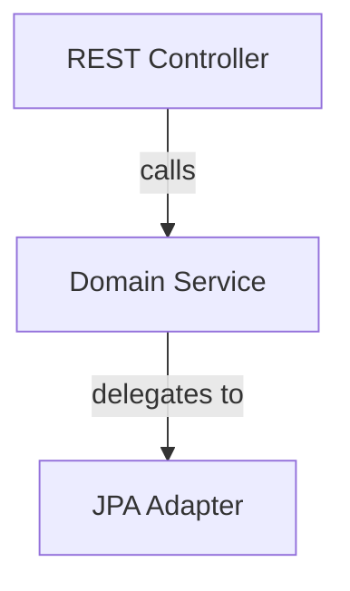
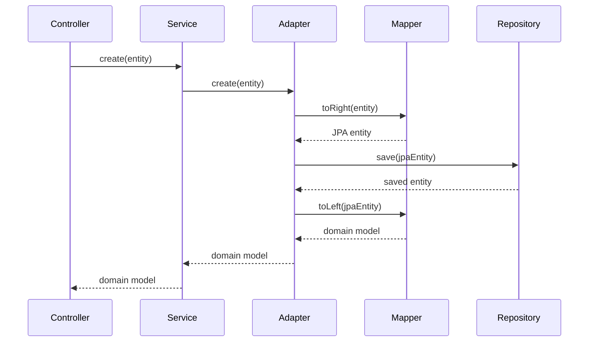
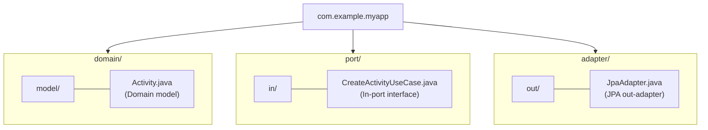
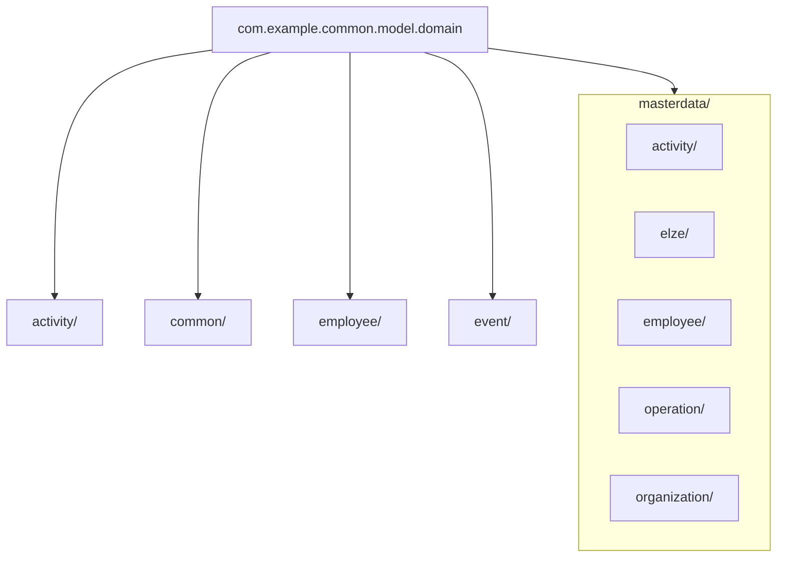
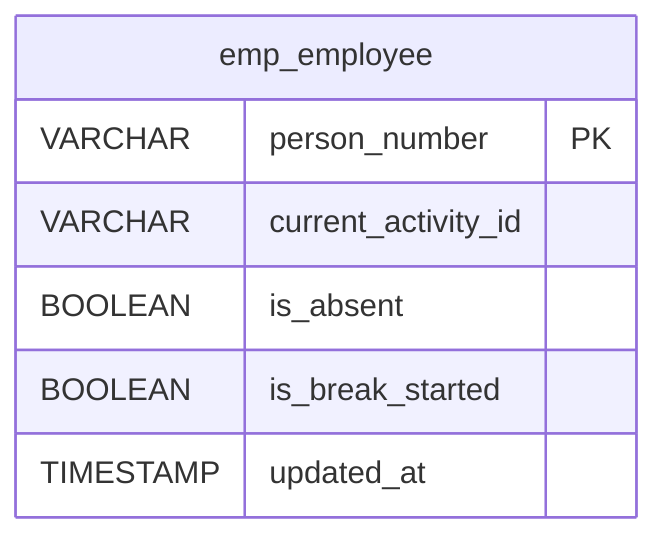

# Markdown Documentation Quality Review

You are a strict formal documentation reviewer. Review the Markdown file(s) at `$ARGUMENTS`
and fix all issues found. **Loop** the check-fix cycle until every check passes green.

## Process

1. **Locate markdownlint config:** Search the project root (walk up from the target file) for
   `.markdownlintrc`, `.markdownlint.yaml`, `.markdownlint.json`, or `.markdownlint.jsonc`.
   Parse the config to know which rules are enabled/disabled and their settings.
2. **Read** each target file completely.
3. **Run markdownlint** via `npx markdownlint-cli <file>` if available. Record violations.
4. **Run all manual checks** from the checklist below, recording each as PASS or FAIL.
5. **Print the combined checklist** with results (use checkmarks and crosses).
6. If any check FAILed: **fix all failures**, then go back to step 2.
7. If all checks PASS and markdownlint returns zero violations: **print the final green
   checklist** and stop.

## Markdownlint Integration

When a markdownlint config is found, apply its rules during generation, review, and fixing.
Key rules to watch (unless disabled in config):

| Rule | Name | What to Check |
|---|---|---|
| MD001 | heading-increment | Headings increase by one level only (no `##` → `####`) |
| MD003 | heading-style | Consistent heading style (ATX `#` vs setext `===`) |
| MD004 | ul-style | Consistent unordered list marker (`-`, `*`, or `+`) |
| MD005 | list-indent | Consistent list indentation |
| MD007 | ul-indent | Unordered list indentation depth (check config for `indent` value) |
| MD009 | no-trailing-spaces | No trailing whitespace on lines |
| MD010 | no-hard-tabs | No hard tab characters |
| MD012 | no-multiple-blanks | No multiple consecutive blank lines |
| MD013 | line-length | Line length limit (check config for `line_length`, `tables`, etc.) |
| MD022 | blanks-around-headings | Blank line before and after headings |
| MD025 | single-h1 | Only one top-level `#` heading per file |
| MD031 | blanks-around-fences | Blank line before and after fenced code blocks |
| MD032 | blanks-around-lists | Blank line before and after lists |
| MD033 | no-inline-html | No inline HTML elements |
| MD034 | no-bare-urls | No bare URLs (wrap in `<>` or `[text](url)`) |
| MD040 | fenced-code-language | Fenced code blocks must have a language tag |
| MD047 | single-trailing-newline | File ends with exactly one newline |
| MD049 | emphasis-style | Consistent emphasis style (`*` vs `_`) |
| MD050 | strong-style | Consistent strong emphasis style (`**` vs `__`) |
| MD060 | table-column-count | Table column counts match (check if disabled in config) |

**If a rule is disabled in the project config, skip that check.** If config sets custom
values (e.g., `MD007.indent: 4`), use those values when fixing.

## Manual Checklist

### Structure Checks

- **S1 — Multi-row table cells:** No table row should continue content on a second row with
  an empty first column. Each logical entry must be a single Markdown table row. Scan every
  table.
- **S2 — Heading hierarchy:** Headings must nest properly (`#` → `##` → `###` → `####`). No
  skipped levels (e.g., `##` directly to `####`). (Overlaps MD001 — report under S2.)
- **S3 — TOC anchor validity:** Every entry in a Table of Contents must link to an existing
  heading. Anchor format: lowercase, spaces → `-`, special chars removed, `&` → `--`.
- **S4 — Internal cross-references:** Every `[text](#anchor)` or `[text](#x-y-z)` link must
  resolve to an existing heading or anchor in the document.
- **S5 — Horizontal rules:** If the document uses `---` as section separators between
  top-level headings, it must do so consistently (all or none).
- **S6 — Consistent heading style:** All headings at the same level should follow the same
  formatting pattern (e.g., all `###` subsections either numbered or not).

### Formatting Checks

- **F1 — Code block language tags:** Every fenced code block must have a language tag (`java`,
  `text`, `sql`, `xml`, `json`, `bash`, `mermaid`, etc.). No untagged blocks. (Overlaps MD040.)
- **F2 — Table alignment:** Tables must have a valid header separator row (`|---|---|`).
  Column counts must match between header, separator, and data rows.
- **F3 — Consistent list style:** Within a single list, all items should use the same marker
  (`-` or `*` or `1.`). No mixing. (Overlaps MD004.)
- **F4 — Trailing whitespace in tables:** Table cells should not have excessive trailing
  spaces that suggest manual column alignment from a different context.
- **F5 — Blockquote consistency:** Blockquotes used for tips/notes/warnings should follow a
  consistent pattern within the document (e.g., all start with `> **Tip:**` or `> **Note:**`).
- **F6 — Prefer Mermaid over ASCII diagrams:** Flowcharts, sequence diagrams, dependency
  trees, package/directory trees, SQL schema listings, and state machines inside `` ```text ``
  blocks should be migrated to `` ```mermaid `` blocks. **Multi-line call chains with
  indentation showing nested calls between components** (e.g., `A.foo() → B.bar() → C.baz()
  → D.qux()` spanning multiple indented lines) are **sequence diagrams** and must be converted
  to `` ```mermaid sequenceDiagram `` blocks. **Package/directory trees** (including
  `├── └──` layouts) must be converted to `` ```mermaid flowchart TD `` blocks (see F7).
  **SQL schema column listings** (table name + `├──` column entries with types) must be
  converted to `` ```mermaid erDiagram `` blocks (see F8). See the
  [Mermaid Migration Guide](#mermaid-migration-guide) below for conversion rules. Exceptions:
  **single-line** call chains and simple one-line arrows are fine as `text`.
- **F7 — Package/directory trees → Mermaid flowchart:** Package/directory tree layouts inside
  `` ```text `` blocks (including `├── └──` structures) must be converted to `` ```mermaid ``
  `flowchart TD` blocks. Use subgraphs to represent directory nesting and nodes for leaf
  entries. If entries carry per-entry remarks (descriptions, comments, role labels), include
  them as node labels or edge labels. See the [Mermaid Migration Guide](#mermaid-migration-guide)
  for conversion rules and examples. This applies to **all** package trees — both annotated
  and plain.
- **F8 — SQL schema column listings → Mermaid erDiagram:** SQL table column listings inside
  `` ```text `` blocks (table name followed by `├──` / `└──` column entries with types) must
  be converted to `` ```mermaid `` `erDiagram` blocks. Each column becomes a row with
  `TYPE column_name` format. Constraints like `PK`, `NOT NULL` go in quoted comments.
  Wildcard/grouped columns (e.g., `start_meta_*` or `col_a, col_b (TYPE)`) must be expanded
  into individual columns. See the [Mermaid Migration Guide](#mermaid-migration-guide)
  for conversion rules and examples.

### Content Checks

- **C1 — Unexplained references:** Code examples must not reference classes, methods, or
  utilities that are not explained or imported anywhere in the document. Every non-obvious
  symbol needs context.
- **C2 — Naming collisions:** Class names in code examples must not shadow well-known
  annotations or types from their ecosystem (e.g., a class named `ExceptionHandler` shadowing
  Spring's `@ExceptionHandler`).
- **C3 — Consistent code patterns:** If the same concept (e.g., constructor injection) appears
  in multiple examples, it should be written the same way everywhere (e.g., always with
  `@RequiredArgsConstructor`, not sometimes with explicit constructors).
- **C4 — Diagram arrow clarity:** Diagrams with arrows must have labels or legends if the
  arrow direction could be ambiguous (e.g., "depends on" vs "used by"). Applies to both
  Mermaid and any remaining ASCII diagrams.
- **C5 — Accurate cross-section claims:** If text says "see Section X for Y", Section X must
  actually contain Y.

### Completeness Checks

- **P1 — Walkthrough completeness:** If the document contains a step-by-step walkthrough or
  Quick Start, it must mention ALL prerequisites (config files, database setup, dependencies)
  needed to actually run the example — not just the code files.
- **P2 — Error path coverage:** If the document shows how to throw/create errors, it must also
  show or link to how those errors are handled/translated (e.g., exception → HTTP response).
- **P3 — Scope accuracy:** Conditional requirements must be scoped correctly. Do not say "you
  need X" when X is only needed for a specific feature. Use "if you use Y, you also need X".

### Developer Experience (DX) Checks

Review the document as a **mid-experienced developer** who knows the language and framework
basics but is new to this library/project. Flag anything that would make them stop and say
*"Wait, what?"*

- **DX1 — Concept introduction order:** Every class, annotation, interface, or pattern must be
  introduced (at least briefly) **before** it is used in an example. If Section 5 references
  `BiDirectionalMapper` but it is only explained in Section 8, that is a FAIL. Fix by adding a
  forward reference (`"... using a BiDirectionalMapper (see [Section 8](#...))"`) or by
  reordering content so explanations come first.
- **DX2 — Jargon & acronym clarity:** Domain-specific terms, abbreviations, and acronyms must
  be spelled out or explained on **first use**. Examples: "CQRS", "out-port", "icomponent",
  "hexagonal architecture". Standard language keywords (`interface`, `abstract`) and universally
  known acronyms (`HTTP`, `REST`, `SQL`, `JPA`, `UUID`) are exempt.
- **DX3 — Why before How:** Every major section or feature must start with a brief motivation
  — *when* and *why* a developer would use it — before jumping into implementation details.
  A section that opens directly with a code block or configuration without context is a FAIL.
  Fix by adding 1–3 sentences of motivation before the first code block.
- **DX4 — Example context:** Code examples must indicate **where** the code lives. At minimum:
  the file name, or the package, or which module/layer it belongs to (e.g., "In your domain
  service:", "In the JPA adapter module:"). An orphan code block with no surrounding context
  about its location is a FAIL. Inline snippets inside explanatory paragraphs are exempt.
- **DX5 — Progressive complexity:** Within a section, examples should progress from simple to
  complex. If the first example in a section uses advanced features (generics, custom
  annotations, callbacks) while a simpler "hello world" variant exists, the order should be
  reversed. The simplest working example should come first.
- **DX6 — Assumed knowledge:** Implicit prerequisites must be stated. If understanding a
  section requires knowledge of another section, framework feature, or external concept, add an
  explicit callout: `> **Prerequisite:** Familiarity with [X](#link) / Spring Data JPA / etc.`
  A section that silently requires knowledge the reader may not have is a FAIL.
- **DX7 — Actionability:** Every concept section must include at least one concrete code
  example or a direct link to one. A section that only describes a concept in prose without
  showing how to use it is a FAIL. Introductory/overview sections (like a TOC or "Library
  Overview") are exempt.

**How to fix DX issues:**

| Issue | Preferred Fix | Alternative Fix |
|---|---|---|
| DX1 forward reference | Reorder content so explanation comes first | Add `(see [Section N](#...))` at point of first use |
| DX2 undefined jargon | Spell out on first use: "CQRS (Command Query Responsibility Segregation)" | Add a glossary section at the end |
| DX3 missing motivation | Add 1–3 sentence intro paragraph before first code block | Add a `> **When to use:**` blockquote |
| DX4 missing context | Add a sentence before the code block: "In your `XyzAdapter.java`:" | Add a comment as the first line of the code block: `// src/main/java/.../XyzAdapter.java` |
| DX5 wrong order | Move the simple example before the advanced one | Add a "Basic usage" subsection before "Advanced usage" |
| DX6 hidden prereqs | Add `> **Prerequisite:**` blockquote at section start | Mention required knowledge in the section's opening paragraph |
| DX7 no code example | Add a minimal code snippet demonstrating the concept | Link to an existing example: "See [Section N](#...) for a working example" |

## Mermaid Migration Guide

When F6 flags an ASCII diagram, convert it using these rules:

### What to Convert

| ASCII Pattern | Mermaid Type | Example |
|---|---|---|
| Vertical box-and-arrow flows (`┌──┐ │ └──┘` with `→` or `▼`) | `flowchart TD` | Request processing pipelines |
| Horizontal box-and-arrow flows | `flowchart LR` | Architecture overviews |
| Decision trees with branches (`├── yes / └── no`) | `flowchart TD` with diamond `{decision}` nodes | Conditional logic |
| Dependency chains (`A depends on B depends on C`) | `flowchart TD` or `flowchart BT` | Module dependencies |
| Sequence of calls between components | `sequenceDiagram` | API call flows |
| Multi-line indented call chains (`A → B → C → D` with nesting) | `sequenceDiagram` | Request flows through layers |
| State transitions | `stateDiagram-v2` | State machines |
| Class hierarchies (tree with `└──`) | `classDiagram` or `flowchart TD` | Inheritance trees |
| Package/directory trees (`├── src/ └── main/`) | `flowchart TD` | Module/package structure |
| SQL schema column listings (`├── col (TYPE)`) | `erDiagram` | Database table structures |

### What NOT to Convert

Leave these as `` ```text `` blocks — Mermaid adds no value:

- **Single-line call chains** (`A.foo() → B.bar() → C.baz()`) — one-liners are clearer as
  text. **Multi-line** indented call chains (3+ lines showing nested calls between components)
  are sequence diagrams and MUST be converted
- **Plain numbered step lists** inside code blocks (e.g., `1. Read config → 2. Validate`) —
  text is more scannable. **However**, if a step list contains **decision branches**
  (`If X → ... / If not → ...`), it is a flowchart and MUST be converted to
  `flowchart TD` with diamond `{decision}` nodes
- **Table-like ASCII layouts** — use actual Markdown tables instead

### Conversion Rules

1. **Node shapes:** Use `["label"]` for components, `(["label"])` for external triggers
   (HTTP requests, events), `[("label")]` for databases/storage, `{"label"}` for decisions.
2. **Edge labels:** Preserve the relationship text from the ASCII diagram as edge labels
   (`-- calls -->`, `-- implements -->`).
3. **Subgraphs:** Use `subgraph` to group related nodes (e.g., "Domain Layer", "Adapter
   Layer") when the ASCII diagram uses visual grouping.
4. **Keep it readable:** Mermaid source must be human-readable. Declare node content on
   separate lines from edges. Use `\n` for multi-line node labels.
5. **Newlines in labels:** Use `\n` inside `"..."` for multi-line labels, e.g.,
   `NODE["Line 1\nLine 2"]`.

### Example Conversion

**Before (ASCII):**

````text
```text
┌─────────────────┐
│  REST Controller │
└────────┬────────┘
         │ calls
         ▼
┌─────────────────┐
│  Domain Service  │
└────────┬────────┘
         │ delegates to
         ▼
┌─────────────────┐
│  JPA Adapter     │
└─────────────────┘
```
````

**After (Mermaid):**

````text

````

### Example: Multi-line Call Chain → Sequence Diagram

**Before (ASCII call chain):**

````text
```text
Controller.create()
  → Service.create()           (delegates to out-port)
    → Adapter.create()         (maps + saves)
      → Mapper.toRight()       (domain → JPA)
      → Repository.save()      (persist)
      → Mapper.toLeft()        (JPA → domain)
```
````

**After (Mermaid):**

````text

````

### Example: Package Tree → Mermaid Flowchart (F7)

**Before (ASCII tree in `text` block):**

````text
```text
com.example.myapp
├── domain
│   └── model
│       └── Activity.java              // Domain model (4.1)
├── port
│   └── in
│       └── CreateActivityUseCase.java // In-port interface (4.2)
└── adapter
    └── out
        └── JpaAdapter.java            // JPA out-adapter (4.3)
```
````

**After (Mermaid):**

````text

````

**Rules:**
1. Root package is the top node.
2. Directories become `subgraph` blocks when they contain children, or plain nodes if leaf-level.
3. Files are leaf nodes with `["FileName.java\n(remark)"]` labels.
4. Use `-->` for parent-to-child directory relationships.
5. Use `---` (undirected) for directory-to-file containment within a subgraph.
6. If the tree has annotations/comments, include them as `\n(remark)` in node labels.

### Example: Plain Package Tree (no annotations) → Mermaid Flowchart (F7)

````text
```text
com.example.common.model.domain
├── activity/
├── common/
├── employee/
├── event/
└── masterdata/
    ├── activity/
    ├── elze/
    ├── employee/
    ├── operation/
    └── organization/
```
````

**After (Mermaid):**

````text

````

### Example: SQL Schema Column Listing → Mermaid erDiagram (F8)

**Before (ASCII column listing in `text` block):**

````text
```text
emp_employee
├── person_number (VARCHAR PK)
├── current_activity_id (VARCHAR)
├── is_absent (BOOLEAN)
├── is_break_started (BOOLEAN)
└── updated_at (TIMESTAMP)
```
````

**After (Mermaid):**

````text

````

**Rules:**
1. Table name becomes the entity name.
2. Each column becomes a row: `TYPE column_name [PK]`.
3. Constraints (`NOT NULL`, `PK`) go after the column name, or in a quoted comment
   for `NOT NULL`: `VARCHAR person_number "NOT NULL"`.
4. Wildcard columns (e.g., `start_meta_*` covering `source, device_id, function`)
   must be expanded into individual columns (`VARCHAR start_meta_source`, etc.).
5. Grouped columns (e.g., `col_a, col_b, col_c (TYPE)`) must be split into
   separate rows, one per column.

## Output Format

Print the checklist as:

```text
## MD Quality Review — <filename>

### Markdownlint (<config-file>)
- [x] markdownlint — 0 violations
  OR
- [ ] markdownlint — FAIL: 3 violations
  - MD031 line 395: Fenced code blocks should be surrounded by blank lines
  - ...

### Structure
- [x] S1 — Multi-row table cells
- [ ] S2 — Heading hierarchy — FAIL: `####` under `##` at line 45

### Formatting
- [x] F1 — Code block language tags
- [ ] F6 — Prefer Mermaid — FAIL: 2 ASCII flowcharts found at lines 54, 251
- [ ] F7 — Package trees with annotations — FAIL: 1 annotated tree in text block at line 120
...

### Content
...

### Completeness
...

### Developer Experience
- [x] DX1 — Concept introduction order
- [ ] DX3 — Why before How — FAIL: Section 6 opens with code block, no motivation
...

---
Result: X/Y passed — <FIXING | ALL GREEN>
```

After fixes, re-read the file and **re-run markdownlint** and print the checklist again.
Repeat until all green.
