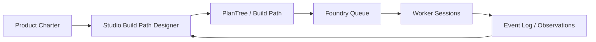

# Foundry and Studio Fusion Handover

This handover captures the product idea only. It intentionally ignores all visual
logo, image, SVG, and icon exploration from the prior conversation.

## Audience

This is for Claude or another architecture/product agent picking up the next
thinking pass on the fusion of:

- `domains/studio`: the path-builder studio UI for authoring intervention-to-outcome
  plan trees through the design-system board-kit.
- Foundry: the product-building machine that turns charters and build paths into
  claimable, gated, reviewable software work.

## Core Thesis

The fusion of Studio and Foundry is the first step toward a powerful software
development tool: a visual compiler for product development.

The tool should not merely manage tickets. It should let a founder, product
designer, or engineering lead author an explicit development logic:

- What product outcome or system effect are we trying to create?
- Which interventions, assumptions, dependencies, and quality gates lead there?
- Which parts of that plan are claimable by worker sessions?
- Which work can safely run in parallel because scopes are disjoint?
- Which effects did we predict, observe, review, and later calibrate?

Studio provides the human-facing authoring surface. Foundry provides the operational
execution machine. Together they turn product intent into structured, executable,
auditable software work.

## Current Studio Shape

The Studio seed is a lean Angular app under `domains/studio/apps/studio-ui`.

Important facts:

- It authors intervention-to-outcome plan trees via the published `<ds-board-kit>`
  design-system brick.
- It uses a strict two-tree discipline:
  - The substrate `PlanTree` is the source of truth.
  - The board-kit `RenderNode` tree is only a derived projection.
- Edits follow the loop:
  - `PlanTree` signal
  - `projectPlanTree()`
  - `RenderNode`
  - `<ds-board-kit>`
  - `EditIntent`
  - `editIntentToPlanEdits()`
  - `PlanTreeEdit[]`
  - `PlanTreeStore.applyEdit()`
  - new `PlanTree`
  - re-projection
- The current store is in-memory but shaped exactly like the kernel port, so live
  substrate wiring should be a store implementation swap, not a rewrite.
- The app also has a Recipe Designer path, which authors board editor shapes as
  data. This is secondary to the fusion idea but important because it hints that
  Studio can become a meta-authoring tool for the development surfaces themselves.

Key local references:

- `projects/studio/project.yaml`
- `domains/studio/README.md`
- `domains/studio/apps/studio-ui/src/app/plan-author.component.ts`
- `domains/studio/apps/studio-ui/src/app/plan-tree/`
- `domains/studio/docs/superpowers/plans/2026-06-17-studio-plan-tree-authoring-s4-s6.md`

## Current Foundry Shape

Foundry is the machine for turning product intent into execution.

Relevant concepts:

- Dossier intake produces product context.
- Opportunity brief scores and frames fit.
- Charter defines the wedge, risk tier, repo plan, and quality obligations.
- Build path turns a charter into:
  - scaffold plan
  - epic ladder
  - UI-surface plan
  - ADR needs
  - quality battery config
  - claimable work items with scopes
  - disjointness proof for parallelism
- Queue and claim state live in the Foundry event log, not in documents.
- Worker sessions claim one work item, build in isolation, verify, review, land,
  and release.
- Gates and review waves make execution auditable rather than magical.

Key local references:

- `docs/superpowers/plans/2026-06-10-foundry-f4-build-path.md`
- `docs/superpowers/specs/2026-06-19-foundry-workflow-build-path-cross-tree-design.md`
- `docs/foundry/agri-ecosystem-twin/build-path.md`
- `projects/studio/project.yaml`

## Product Fusion

The fused product should be understood as:

> A visual development foundry where strategy, causal plan trees, build paths,
> quality gates, agent work, and observed delivery outcomes are one explicit,
> replayable structure.

The user should not start by creating Jira-style tasks. They should author or
review a structured plan tree:

- Product goal or wedge
- Capabilities and interventions
- Expected effects
- Build path decomposition
- Dependencies
- Scope boundaries
- Quality obligations
- Gates
- Worker-ready items

Foundry then compiles or actuates that structure into execution:

- Queue items
- Claim protocol
- Session prompts
- Review wave expectations
- Merge and release ritual
- Event-log observations
- Calibration feedback

This makes the plan itself the bridge between product strategy and software work.

## Why This Matters

Most development systems lose information between strategy and execution:

- Strategy lives in prose.
- Work lives in tickets.
- Architecture lives in separate docs.
- Quality gates live in CI or review convention.
- Agent work lives in prompts and chat history.
- Outcomes live in post-hoc reports.

The fusion should collapse those into one explicit development graph without
collapsing governance. The goal is not an "AI builds apps from prompts" toy. The
goal is AI-assisted product engineering with visible structure, constraints,
review, replay, and calibration.

The powerful idea is that a plan tree can become operational:

- Human-authored enough to preserve intent.
- Machine-readable enough to generate work.
- Governed enough to avoid runaway automation.
- Observable enough to learn from outcomes.

## First Product Slice

The recommended first slice is a Foundry Build Path Designer inside Studio.

This should be a focused authoring surface for turning a product charter into a
Foundry build path. It should not try to become a full IDE yet.

Minimum capabilities:

- Load or import a charter-shaped product description.
- Show the product/build path as a plan tree through board-kit.
- Author epics, work items, dependencies, and lanes visually.
- Attach quality obligations to work items.
- Define scope for each work item.
- Surface disjointness conflicts before queue push.
- Preview the worker-session prompts that Foundry would generate.
- Keep all operational queue/claim state in Foundry, not in the document UI.

This slice would prove the main bridge:

## Architectural Constraints

Keep the kernel simple.

The fusion must respect the substrate kernel boundary:

- Kernel owns the simple typed plan tree, observations, inference, and reproducibility.
- Pack-specific authoring concerns stay in Studio or Foundry pack code.
- UI state and layout geometry do not become kernel state.
- The board-kit render tree remains a projection, not an authority.
- Queue/claim state remains event-log-derived Foundry state, not copied into Studio.
- Cross-tree relationships should be references or derived views, never multi-parent
  plan-tree structure.

This matters because the fusion will be tempting to over-model. Resist that. The
tool becomes powerful by keeping execution explicit while keeping the substrate
small.

## Open Design Questions

These questions are good next targets for Claude:

- What is the minimal domain model for a Studio-authored Foundry build path?
- Is the build path represented directly as a `PlanTree`, or as a projection from
  Foundry product/work-item state into a Studio-editable view model?
- Where is the boundary between editing a design document and actuating Foundry?
- How should disjointness conflicts be visualized before queue push?
- How should quality obligations appear in the node inspector without making the
  authoring surface feel like a form-heavy admin tool?
- How should founder gates appear: explicit nodes in the plan, side-panel metadata,
  or derived workflow stages?
- What is the smallest live-substrate integration for Studio that proves the port
  swap without coupling Studio to Foundry internals?
- How does the Recipe Designer eventually support this, if Studio also needs to
  author custom development surfaces?

## Suggested Next Pass

Claude should produce a concise design note for the first slice:

- Name: `Studio Foundry Build Path Designer`
- Scope: `domains/studio` plus read/write integration points with Foundry
- Non-goals: full IDE, code editor, live worker orchestration UI, arbitrary workflow
  editor
- Primary workflow: charter to visual build path to Foundry queue preview
- Data flow: Studio projection, edit intents, persistence boundary, Foundry push
- UX surfaces: tree canvas, inspector, disjointness panel, quality obligations panel,
  prompt preview
- Governance: no kernel change unless the ADR-176 inclusion test is clearly met

The design should stay slice-sized. The immediate goal is to prove the bridge from
visual authoring to Foundry execution, not to ship the whole software development
environment.
