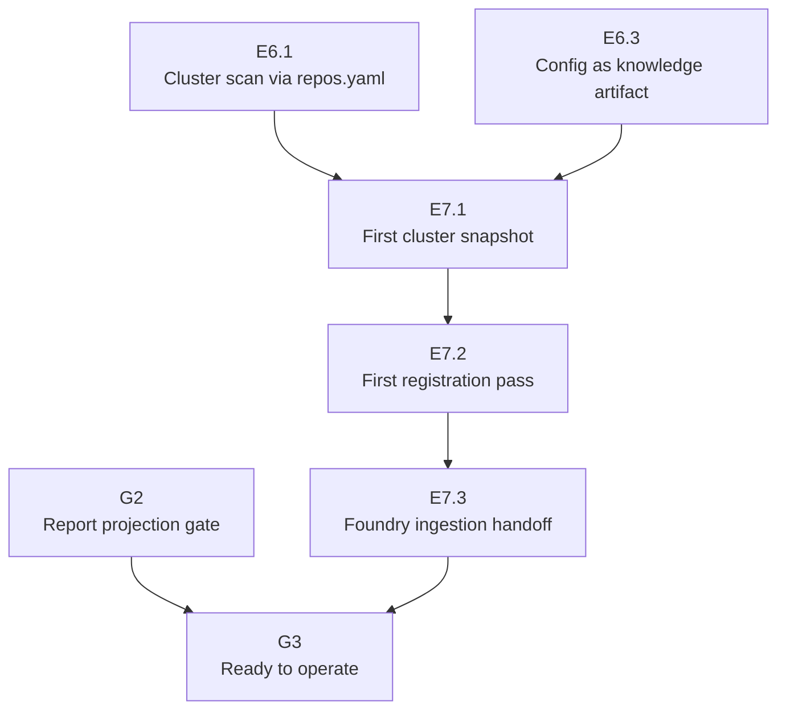

# Artifact Graph Foundry Ingestion Handoff

## Purpose

This is the E7.3 handoff for `knowledge-layer/artifact-graph`.
It turns the dogfood evidence from E7.1 and the first registration pass from
E7.2 into an operating contract for Foundry ingestion and the final G3 gate.

The handoff does not create a new source of truth. The canonical plan remains
`docs/foundry/knowledge-layer/artifact-graph.charter-blueprint.json`; this file
names the evidence bundle and the rules a future ingestion/sync path must obey.

## Handoff Bundle

| Artifact | Role |
|---|---|
| `artifact-graph.charter-blueprint.json` | Canonical `CharterBlueprint` with stable node ids, parent links, dependencies, labels, and scopes. |
| `artifact-graph.plan-tree.md` | Human-readable projection of the blueprint for review and scanner discovery. |
| `artifact-graph-slice-0-design.md` | Slice design that fixes boundaries: Knowledge owns artifact discovery, citations, snapshots, and reports; substrate stays untouched. |
| `artifact-graph-g0-zero-kernel-change-evidence.md` | Gate evidence for the zero-kernel-change invariant. |
| `artifact-graph-first-cluster-snapshot-review.md` | E7.1 cluster-scan triage and report index. |
| `reports/cluster/artifact-graph-first-cluster-snapshot.json` | Historical full-cluster scan output from E7.1. It is immutable evidence for that run, not the current cluster state. |
| `reports/{workbench,specs,knowledge}/` | Deterministic focused projections for artifacts, citation graph, stale snapshots, and registration candidates from E7.1. |
| [workbench#241](https://github.com/de-braighter/workbench/pull/241) | E7.1 PR: first cluster snapshot and report projections. |
| [workbench#243](https://github.com/de-braighter/workbench/pull/243) | E7.2 PR: first Workbench registration pass over ten high-signal specs. |

## Ingestion Rules

1. **Use the blueprint JSON for structure.** Foundry ingestion must read node ids,
   parent ids, dependencies, labels, roles, and scope prefixes from
   `artifact-graph.charter-blueprint.json`.
2. **Treat Markdown as projection or evidence.** `artifact-graph.plan-tree.md`
   is useful for humans and scanners, but it must not override the JSON plan.
3. **Preserve dependency direction.** E7.3 depends on E7.2; G3 depends on E7.3.
   G2 remains the report-projection gate for E5 and is independent of the E7
   dogfood leaf except through final readiness.
4. **Keep generated reports non-authoritative.** Report files are deterministic
   projections from scan manifests. They may drive triage and review, but they
   must not become writable source state.
5. **No kernel promotion.** Artifact graph vocabulary stays in Knowledge docs and
   packages unless a future candidate passes ADR-176: one of the four kernel
   concerns and needed by at least two packs as infrastructure the kernel must
   validate, query, or version.
6. **Keep registration manual in Slice 0.** E7.2 proves manual frontmatter
   registration of high-value docs. Automated migration or write-back remains
   outside Slice 0.

## Dependency Map

## Current Dogfood State

E7.1 produced a valid `knowledge-cluster-scan.v1` report for 20 repositories.
The command exited `1` because the scanner correctly surfaced fail-level
diagnostics already present in the cluster. This is expected dogfood output, not
a report-generation failure.

E7.2 registered the first Workbench-owned high-signal candidates from the
Workbench report projection:

| Rank Source | Path | Registered Artifact Id |
|---:|---|---|
| 1 | `docs/superpowers/specs/2026-06-12-adr-draft-tier5-cascade.md` | `adr-draft-tier5-cascade` |
| 2 | `docs/superpowers/specs/2026-06-07-substrate-tree-renderer-north-star.md` | `substrate-tree-renderer-north-star` |
| 3 | `docs/superpowers/specs/2026-06-18-foundry-v1-P7-browser-runtime-design.md` | `foundry-v1-p7-browser-runtime-design` |
| 4 | `docs/superpowers/specs/2026-06-20-foundry-workflow-cockpit-design.md` | `foundry-workflow-cockpit-design` |
| 5 | `docs/superpowers/specs/2026-06-19-foundry-observability-dashboard-design.md` | `foundry-observability-dashboard-design` |
| 6 | `docs/superpowers/specs/2026-06-19-foundry-workflow-build-path-cross-tree-design.md` | `foundry-workflow-build-path-cross-tree-design` |
| 7 | `docs/superpowers/specs/2026-06-20-foundry-workflow-conductor-walk-design.md` | `foundry-workflow-conductor-walk-design` |
| 8 | `docs/superpowers/specs/2026-06-20-foundry-workflow-derived-advancement-design.md` | `foundry-workflow-derived-advancement-design` |
| 9 | `docs/superpowers/specs/2026-06-19-foundry-dashboard-interactive-actions-design.md` | `foundry-dashboard-interactive-actions-design` |
| 10 | `docs/superpowers/specs/2026-06-19-foundry-workflow-as-first-class-actions-design.md` | `foundry-workflow-as-first-class-actions` |

The PR #243 verifier wave confirmed that a focused Workbench scan sees all ten
paths with the expected `artifact_id` values and no
`malformedFrontmatter`, `duplicateArtifactIds`, or `unknownArtifactKind`
diagnostics on the touched files.

## G3 Readiness Checklist

G3 may pass when all rows are green on the current mainline:

| Check | Evidence Source | Status |
|---|---|---|
| Knowledge `ci:local` | Knowledge repo PR wave for the latest runtime/report changes. | Pending G2/current-main verification. |
| Markdown quality for Foundry handoff docs | `npx markdownlint-cli "docs/foundry/knowledge-layer/**/*.md"` in Workbench. | Required for E7.3. |
| Zero kernel change | `git diff --name-only origin/main...HEAD` has no `layers/substrate/**` path, plus charter-checker review. | Required for E7.3/G3. |
| Read-only default | E7.1/E6 runtime evidence: scans write JSON to stdout unless `--out` is explicit. | Evidence exists; re-confirm in G3. |
| Secret safety | G1 runtime tests and E7.1 redacted fail diagnostics. | Evidence exists; re-confirm in G3. |
| Report determinism | G2 report-projection gate over `libs/knowledge-runtime`. | Pending G2. |
| Registration handoff | PR #243 focused scan assertion over the ten first-pass files. | Complete. |

## Open Backlog After E7.3

- **G2 remains claimable.** It should prove report projection determinism from
  `libs/knowledge-runtime` and snapshot diff behavior before G3.
- **Specs repo registration is still open.** E7.1 identified ADR-176, ADR-127,
  north-star, ADR-154, and ADR-027 as high-value specs-corpus candidates. E7.2
  only changed Workbench-scoped docs, so these remain a follow-up lane in the
  Specs repo.
- **Full Workbench profile still has pre-existing sensitive diagnostics.**
  PR #243 local-ci confirmed the current full Workbench profile reports existing
  `sensitiveContentDetected` findings outside the ten E7.2 paths. Treat them as
  a green-desk backlog, not an E7.3 blocker.
- **Automated write-back remains out of scope.** Slice 0 proves scanning and
  registration evidence; it does not mutate source repositories.

## Release Criteria For This Handoff

This E7.3 item is complete when:

- this handoff scans as a managed Knowledge artifact;
- Markdown in `docs/foundry/knowledge-layer/**/*.md` passes;
- the diff stays confined to `docs/foundry/knowledge-layer/**`;
- the focused Workbench scan reports this file without malformed frontmatter or
  unknown artifact kind diagnostics;
- reviewer and charter-checker agree that it changes only operational evidence,
  not runtime, kernel, or source-of-truth structure.
