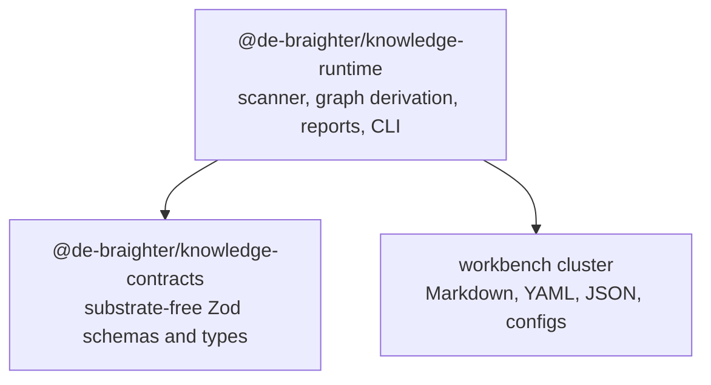
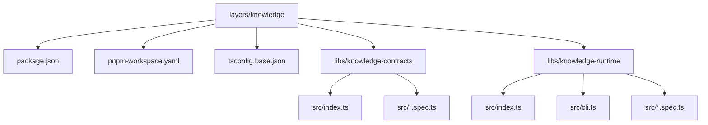
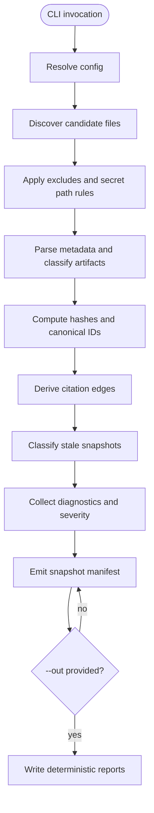

# Knowledge Layer Artifact Graph Slice 0 Design

## Purpose

This design executes PlanTree item `E0.1 - Write artifact-graph slice design` from
the canonical blueprint:

```text
docs/foundry/knowledge-layer/artifact-graph.charter-blueprint.json
```

Slice 0 establishes a dedicated `layers/knowledge` layer and proves the first
useful capability: a read-only artifact graph over the workbench cluster. It must
inventory documents and structured config, compute stable hashes, derive citation
edges, classify stale artifact snapshots, and emit deterministic reports without
mutating source repositories.

## Existing Basis And Non-Duplication

This Slice 0 is not a fresh Knowledge concept. It narrows the already-approved
Knowledge Pack direction from
`docs/superpowers/specs/2026-06-28-knowledge-pack-design.md` into the first
claimable implementation surface.

The current local cluster already contains two adjacent pieces:

- `layers/charter-runtime` has the S2 charter blueprint engine on `main`.
- `layers/foundry-core` has a Knowledge Skin with an injectable
  `createKnowledgeNode` port on `main`.

Therefore Slice 0 must not re-author blueprint execution. Blueprint definition is a
Knowledge artifact/skin concern; blueprint instantiation and execution stay in
`charter-runtime`. The artifact graph owns read-only discovery, citation edges,
snapshot refs, staleness diagnostics, and later context-navigation inputs.

## Outcome

After Slice 0, the cluster should have:

- A plain TypeScript pnpm workspace at `layers/knowledge`.
- `@de-braighter/knowledge-contracts`, a substrate-free contract package.
- `@de-braighter/knowledge-runtime`, a read-only scanner and CLI package.
- Repo-local and cluster scan commands.
- Snapshot manifests containing scan metadata, artifacts, edges, and diagnostics.
- Deterministic report projections generated only with explicit `--out`.
- Safety checks for sensitive paths and secret-like content.
- No substrate production changes.

## Non-Goals

- No database.
- No write path into docs, repos, Foundry, or substrate.
- No automatic frontmatter migration.
- No full context-pack generation yet.
- No Git history traversal in Slice 0.
- No kernel table, contract, or runtime change.
- No attempt to make generated reports authoritative state.

## Architecture

The first slice has a strict dependency direction.



`knowledge-contracts` must import no `@de-braighter/substrate-*` package. The
runtime may scan files that mention substrate, but the layer itself remains
outside the kernel. `charter-runtime` integration is deferred to item `E4.3`.

## Workspace Shape

`E0.2` should first reconcile active Knowledge/blueprint implementation state, then
scaffold this shape only if no active implementation already owns it.



The workspace should follow the lightweight pattern used by `layers/charter-runtime`
and `layers/foundry-core`: TypeScript, ESM, Vitest, pnpm, no Nx requirement.

## Package Responsibilities

### `@de-braighter/knowledge-contracts`

This package owns the stable data contracts. It must remain substrate-free and
side-effect free.

It should export:

- `ArtifactBand`
- `ArtifactKind`
- `ConfigClass`
- `EvidenceClass`
- `ArtifactLevel`
- `ArtifactStatus`
- `ArtifactAuthority`
- `OwnerRole`
- `ContentHash`
- `ArtifactFrontmatter`
- `ArtifactIdentity`
- `ArtifactRow`
- `ArtifactSnapshotRef`
- `StalenessState`
- `CitationEdge`
- `Diagnostic`
- `DiagnosticSeverity`
- `ScanMetadata`
- `ScanManifest`
- `KnowledgeConfig`

### `@de-braighter/knowledge-runtime`

This package owns runtime behavior. It imports `knowledge-contracts` and provides:

- File discovery from scan profiles.
- Markdown frontmatter parsing.
- Markdown link extraction.
- YAML and JSON artifact classification.
- Content hashing.
- Canonical artifact ID derivation.
- Citation edge derivation.
- Stale snapshot classification.
- Diagnostics and severity handling.
- Secret-path exclusion and secret-like pattern detection.
- Deterministic report projections.
- CLI commands.

## Artifact Model

Managed artifacts carry frontmatter. Unmanaged artifacts are still discovered and
reported as `unregistered`.

```yaml
artifact_id: artifact-graph-slice-0-design
artifact_kind: design-note
artifact_level: technical
status: draft
authority: local-decision
owner_role: technical-architect
```

`artifact_id` is repo-local. Cluster scans derive the canonical ID:

```text
<owner>/<repo>:<artifact_id>
```

For this cluster, examples are:

```text
de-braighter/workbench:artifact-graph-slice-0-design
de-braighter/specs:adr-176
```

## Artifact Taxonomy

Artifact kinds are grouped into three bands.

| Band | Kinds |
|---|---|
| Core | `charter`, `adr`, `design-note`, `task-spec`, `evidence` |
| Extended | `strategy`, `principle`, `standard`, `reference-architecture` |
| Operational | `config` |

ADRs use one kind plus a level:

```yaml
artifact_kind: adr
artifact_level: technical
```

Config files use `config_class`:

```yaml
artifact_kind: config
config_class: ci
```

Allowed `config_class` values:

```text
project | package | workspace | ci | test | lint | quality | tool | policy | knowledge
```

Observation artifacts use `artifact_kind: evidence` and `evidence_class`:

```yaml
artifact_kind: evidence
evidence_class: coverage
```

Allowed `evidence_class` values:

```text
test | coverage | quality | review | run-manifest | knowledge | release | incident
```

## Citation Edges

Slice 0 derives three edge types.

| Edge Type | Source | Meaning |
|---|---|---|
| `declared` | Frontmatter refs | Strong semantic relation maintained by the author. |
| `discovered` | Markdown links | Automatic relation found while scanning content. |
| `snapshot` | Artifact snapshot refs | Reproducible relation from a charter or artifact snapshot. |

Frontmatter may declare semantic refs with this shape:

```yaml
refs:
  supports:
    - de-braighter/specs:adr-176
  related:
    - de-braighter/workbench:planning-specification-substrate-unification
  supersedes: []
```

Markdown links produce `discovered` edges. If the target file is registered, the
edge resolves to its canonical ID. If not, the target becomes an `unregistered`
artifact or a `missingLinkTargets` diagnostic.

## Artifact Snapshots And Staleness

Charter nodes will eventually store artifact snapshots. Slice 0 should support
the contract and classification without requiring charter-runtime integration.

Snapshot refs have this shape:

```yaml
artifact_snapshots:
  - canonicalArtifactId: de-braighter/specs:adr-176
    label: ADR-176 kernel minimality
    contentHash: sha256:example
    expectedStatus: ratified
```

Staleness is classified as:

| State | Meaning |
|---|---|
| `clean` | Snapshot hash and expected status match current artifact. |
| `content-drift` | Artifact exists and status matches, but hash changed. |
| `status-drift` | Artifact exists, but current status differs from expected status. |
| `missing` | Snapshot points to an artifact not found in the current scan. |
| `unregistered` | Snapshot target exists only as an unstable path-derived artifact. |

This is not a merge gate by default. It is a diagnostic that can become stricter
once the first dogfood scans stabilize.

## Scan Profiles

The scanner should have built-in profiles and accept config overrides.

| Profile | Include |
|---|---|
| `workbench` | `docs/**/*.md`, `policies/**/*.md`, `workflows/**/*.md`, `templates/**/*.md`, `projects/**/*.yaml`, `AGENTS.md`, `README.md`, structured config |
| `specs` | `adr/**/*.md`, `concepts/**/*.md`, `handbook/**/*.md`, `cookbook/**/*.md`, `README.md`, structured config |
| `default` | `docs/**/*.md`, `README.md`, structured config |
| `all-md` | all Markdown files after excludes |

Structured config discovery should include known project and quality files:

```text
package.json
pnpm-workspace.yaml
nx.json
tsconfig*.json
vitest.config.ts
eslint.config.mjs
.markdownlint.json
.github/workflows/*.yml
```

Observation artifacts are excluded by default. CI or learning mode may include:

```text
coverage/**
test-results/**
reports/**
sonar-report*
```

Large generated directories remain excluded unless explicitly enabled.

## Excludes And Secret Safety

The scanner must never treat known sensitive or generated paths as ordinary
source artifacts.

Hard excludes:

```text
**/.git/**
**/node_modules/**
**/dist/**
**/coverage/**
**/.nx/**
**/.turbo/**
**/.claude/worktrees/**
**/.codex/**
**/.env*
**/*.pem
**/*.key
**/*.p12
**/id_rsa*
```

For scanned text files, the runtime also performs secret-like pattern detection.
Diagnostics must report path and finding type only. They must not include the
secret value.

Sensitive findings are fail-level by default.

## Config Resolution

Knowledge has built-in defaults and supports optional `knowledge.config.yaml`.

Resolution order:

1. CLI flags.
2. Nearest `knowledge.config.yaml`.
3. Workbench `knowledge.config.yaml`.
4. Built-in defaults.

`knowledge.config.yaml` is itself an artifact:

```yaml
artifact_kind: config
config_class: knowledge
```

The active config hash is stored in scan metadata.

## Snapshot Manifest

The snapshot manifest is the canonical scanner output. It contains no full text
and no snippets by default.

```json
{
  "scan": {
    "scanId": "uuid",
    "createdAt": "2026-06-30T00:00:00.000Z",
    "mode": "repo",
    "root": "D:/development/projects/de-braighter/workbench",
    "profile": "workbench",
    "configHash": "sha256:example"
  },
  "artifacts": [],
  "edges": [],
  "diagnostics": []
}
```

Artifacts include:

```json
{
  "canonicalArtifactId": "de-braighter/workbench:artifact-graph-slice-0-design",
  "artifactId": "artifact-graph-slice-0-design",
  "repo": "de-braighter/workbench",
  "path": "docs/foundry/knowledge-layer/artifact-graph-slice-0-design.md",
  "artifactKind": "design-note",
  "artifactLevel": "technical",
  "status": "draft",
  "authority": "local-decision",
  "ownerRole": "technical-architect",
  "contentHash": "sha256:example",
  "sizeBytes": 12345,
  "registered": true
}
```

## Diagnostics

Slice 0 diagnostics:

| Diagnostic | Default Severity | Meaning |
|---|---|---|
| `unregisteredArtifacts` | warn | File was scanned without managed frontmatter. |
| `duplicateArtifactIds` | fail | Two artifacts in the same repo share an `artifact_id`. |
| `missingLinkTargets` | warn | A Markdown or declared ref target cannot be resolved. |
| `malformedFrontmatter` | fail | Managed frontmatter is invalid YAML or invalid shape. |
| `unknownArtifactKind` | fail | Frontmatter names a kind outside the taxonomy. |
| `staleSnapshots` | warn | A snapshot is content-drift, status-drift, missing, or unregistered. |
| `sensitiveContentDetected` | fail | Secret-like content appeared in a scanned file. |

Severity is configurable, but these defaults are the Slice-0 contract.

## CLI

The runtime should expose three commands.

Repo-local scan:

```bash
knowledge scan --root <repo> --profile <profile>
```

Cluster scan:

```bash
knowledge scan-cluster --workbench <cluster-root>
```

Snapshot diff:

```bash
knowledge diff-snapshots --from <old.json> --to <new.json>
```

Default behavior:

- Write JSON snapshot to stdout.
- Write nothing to disk.
- Exit non-zero on fail-level diagnostics.

Optional report output:

```bash
knowledge scan --root <repo> --out reports/knowledge/latest
```

Reports:

```text
artifacts.json
citation-graph.json
stale-report.md
registration-candidates.md
```

Reports are deterministic projections from the snapshot manifest. They are not
source of truth.

## Runtime Pipeline



## Test Plan

### Contract Tests

- Accept valid managed frontmatter.
- Reject malformed frontmatter.
- Reject unknown artifact kinds.
- Accept config artifacts with valid `config_class`.
- Accept evidence artifacts with valid `evidence_class`.
- Validate snapshot manifest rows.
- Validate diagnostic severity defaults.

### Runtime Tests

- Discover files using each built-in profile.
- Exclude sensitive and generated paths.
- Classify Markdown, YAML, JSON, package metadata, and CI configs.
- Derive repo-local and canonical artifact IDs.
- Detect duplicate repo-local artifact IDs.
- Extract Markdown discovered edges.
- Extract frontmatter declared edges.
- Resolve registered Markdown targets.
- Emit missing-target diagnostics for unresolved links.
- Classify stale snapshots into every staleness state.
- Detect secret-like content and redact report values.
- Prove default CLI scan writes nothing.
- Prove `--out` writes exactly the expected report files.
- Prove report output is deterministic for the same snapshot.
- Diff two snapshots into artifact-change signals.

### Boundary Tests

- `knowledge-contracts` imports no `@de-braighter/substrate-*` package.
- `knowledge-runtime` imports `knowledge-contracts`, not `charter-runtime`.
- No production file under `layers/substrate` changes for Slice 0.

## Acceptance Criteria

- [ ] `layers/knowledge` exists as a plain TypeScript pnpm workspace.
- [ ] `@de-braighter/knowledge-contracts` builds and tests green.
- [ ] `@de-braighter/knowledge-runtime` builds and tests green.
- [ ] `knowledge scan --root <repo>` emits a valid snapshot manifest to stdout.
- [ ] Default scan writes no files.
- [ ] `--out` writes deterministic report projections.
- [ ] Scanner detects registered and unregistered artifacts.
- [ ] Scanner derives declared, discovered, and snapshot edges.
- [ ] Scanner classifies stale snapshots.
- [ ] Scanner handles YAML, JSON, CI configs, package metadata, and Markdown.
- [ ] Sensitive paths are excluded.
- [ ] Secret-like content emits redacted fail-level diagnostics.
- [ ] No substrate production file changes.
- [ ] Markdown docs for the slice lint cleanly.

## Work Item Mapping

This design feeds the next claimable items:

| PlanTree Item | Uses This Section |
|---|---|
| E0.2 - Reconcile and scaffold Knowledge layer | Existing Basis, Workspace Shape, Package Responsibilities |
| E0.3 - Register layer in workbench | Outcome, Architecture |
| G0 - Zero kernel change | Architecture, Boundary Tests |
| E1.1 to E1.4 | Artifact Model, Taxonomy, Snapshot Manifest, Diagnostics |
| E2.1 to E2.4 | Scan Profiles, Excludes, Runtime Pipeline, Test Plan |
| E3.1 to E3.3 | Citation Edges, Diagnostics |
| E4.1 to E4.3 | Artifact Snapshots And Staleness |
| E5.1 to E5.3 | CLI, Snapshot Manifest, Reports |
| E6.1 to E6.3 | Config Resolution, Scan Profiles |

## Quality Plan

The first code PR for `layers/knowledge` is non-trivial and cross-cutting. It
should get:

- `pnpm ci:local` in `layers/knowledge`.
- Full verifier wave.
- `charter-checker` focus on zero kernel change and dependency direction.
- Security/risk review focus on secret handling and redaction.
- Review floor for docs-only follow-ups.

## Open Questions

1. Is there an active external Claude worktree or branch for `layers/knowledge` that
   should become the implementation source, or is local scaffold still the first code
   step?
2. Should `knowledge-runtime` use only Node built-ins for globbing and YAML, or
   allow small dependencies such as `yaml` and `fast-glob`?
3. Should `missingLinkTargets` become fail-level once the first registration pass
   is complete?
4. Should the first dogfood scan include observation artifacts, or keep the first
   run source-only?

## Next Step

Proceed to `E0.2 - Reconcile and scaffold Knowledge layer` once the active
Knowledge/blueprint implementation state is clear.
