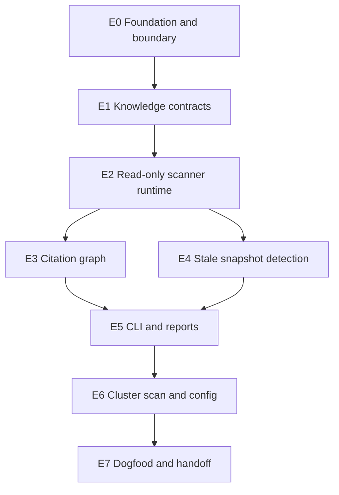

# Artifact Graph Charter PlanTree Projection

This document is the human projection of the canonical CharterBlueprint JSON:

```text
docs/foundry/knowledge-layer/artifact-graph.charter-blueprint.json
```

The JSON is the source of truth. This Markdown file exists for review, scanning,
and handoff into Foundry.

This plan builds on the existing Knowledge Pack design in
`docs/superpowers/specs/2026-06-28-knowledge-pack-design.md`, the landed
`charter-runtime` S2 blueprint engine, and the `foundry-core` Knowledge Skin. It
does not re-author blueprint execution. The artifact graph is the first read-only
Knowledge Slice 0 implementation surface.

## Purpose

The `knowledge-layer/artifact-graph` plan turns the planning/specification
unification design into claimable work. It keeps the substrate kernel untouched,
builds a dedicated `layers/knowledge` layer, and proves the first non-SDLC
capability: Knowledge / Context Navigation.

## Root Charter

| Field | Value |
|---|---|
| Product | `knowledge-layer/artifact-graph` |
| Objective | Build Knowledge Slice 0 as a substrate-compatible artifact graph. |
| Outcome | The cluster has a read-only knowledge layer that inventories artifacts, derives citations, classifies stale snapshots, and prepares context navigation without kernel changes. |
| Canonical file | `docs/foundry/knowledge-layer/artifact-graph.charter-blueprint.json` |

## Epics

| Epic | Label | Outcome |
|---|---|---|
| E0 | Foundation and boundary | Canonical plan, repo/workspace target, and zero-kernel-change gate. |
| E1 | Knowledge contracts | Substrate-free contracts for artifacts, edges, diagnostics, and snapshots. |
| E2 | Read-only scanner runtime | File discovery, metadata parsing, hashes, config classification, and secret safety. |
| E3 | Citation graph | Declared, discovered, and snapshot edges plus registration candidates. |
| E4 | Stale snapshot detection | Clean, content-drift, status-drift, missing, and unregistered classification. |
| E5 | CLI and reports | JSON stdout by default, deterministic reports with explicit `--out`. |
| E6 | Cluster scan and config | `repos.yaml` cluster scan plus `knowledge.config.yaml` resolution. |
| E7 | Dogfood and handoff | First workbench-cluster scan, first registration pass, and Foundry ingestion handoff. |

## Dependency Shape



## Claimable Work

| ID | Role | Label | Depends On | Scope |
|---|---|---|---|---|
| E0.1 | task | Write artifact-graph slice design | none | `docs/foundry/knowledge-layer` |
| E0.2 | task | Reconcile and scaffold Knowledge layer | E0.1 | docs, `layers/knowledge` |
| E0.3 | task | Register layer in workbench | E0.2 | `repos.yaml`, docs |
| G0 | gate | Zero kernel change | E0.2, E0.3 | docs, `layers/knowledge` |
| E1.1 | task | Artifact identity and taxonomy | G0 | `layers/knowledge` |
| E1.2 | task | Snapshot and staleness contracts | E1.1 | `layers/knowledge` |
| E1.3 | task | Edges and diagnostics contracts | E1.1 | `layers/knowledge` |
| E1.4 | task | Snapshot manifest contract | E1.2, E1.3 | `layers/knowledge` |
| E2.1 | task | Scan profiles and discovery | E1.4 | `layers/knowledge` |
| E2.2 | task | Metadata parsing and config classification | E2.1 | `layers/knowledge` |
| E2.3 | task | Hashes and canonical IDs | E2.2 | `layers/knowledge` |
| E2.4 | task | Secret safety and redaction | E2.1 | `layers/knowledge` |
| G1 | gate | Read-only and secret-safe scanner | E2.3, E2.4 | `layers/knowledge` |
| E3.1 | task | Markdown discovered edges | E2.3 | `layers/knowledge` |
| E3.2 | task | Frontmatter declared edges | E2.2 | `layers/knowledge` |
| E3.3 | task | Registration candidates | E3.1, E3.2 | `layers/knowledge` |
| E4.1 | task | Snapshot resolver | E1.2, E2.3 | `layers/knowledge` |
| E4.2 | task | Staleness classifier | E4.1 | `layers/knowledge` |
| E4.3 | task | Charter snapshot type integration | E4.1 | `layers/charter-runtime`, `layers/knowledge` |
| E5.1 | task | CLI JSON stdout | E3.3, E4.2 | `layers/knowledge` |
| E5.2 | task | Deterministic reports | E5.1 | `layers/knowledge` |
| E5.3 | task | Snapshot diff | E5.1 | `layers/knowledge` |
| G2 | gate | Report projection gate | E5.2, E5.3 | `layers/knowledge` |
| E6.1 | task | Cluster scan via `repos.yaml` | E5.1 | `layers/knowledge`, `repos.yaml` |
| E6.2 | task | Knowledge config resolution | E5.1 | `layers/knowledge`, `knowledge.config.yaml` |
| E6.3 | task | Config as knowledge artifact | E6.2 | `layers/knowledge`, `knowledge.config.yaml` |
| E7.1 | task | First cluster snapshot | E6.1, E6.3 | `docs/foundry/knowledge-layer` |
| E7.2 | task | First registration pass | E7.1 | `docs/superpowers/specs`, docs |
| E7.3 | task | Foundry ingestion handoff | E7.2 | `docs/foundry/knowledge-layer` |
| G3 | gate | Ready to operate | E7.3 | docs, `layers/knowledge` |

## Gates

| Gate | Must Prove |
|---|---|
| G0 - Zero kernel change | No substrate production file changes; no knowledge vocabulary under `layers/substrate` production code. |
| G1 - Read-only and secret-safe scanner | Default scan writes nothing, sensitive paths are excluded, sensitive findings are redacted and fail-level. |
| G2 - Report projection gate | Reports are deterministic projections from snapshot manifests, not source of truth. |
| G3 - Ready to operate | Local CI, Markdown quality, zero-kernel-change, read-only default, secret safety, and report determinism are green. |

## Quality Battery

Every implementation PR for this tree should carry:

- `ci:local` for the touched repo.
- Review floor for docs-only changes.
- Full verifier wave for code, contracts, scanner behavior, CLI behavior, or
  cross-layer dependency changes.
- `charter-checker` focus on ADR-176, zero-kernel-change, and dependency direction.
- Secret-safety tests before any scanner output is considered usable.

## Runtime Posture

The canonical JSON should flow through three stages:

1. **Canonical artifact:** `artifact-graph.charter-blueprint.json`.
2. **Foundry operation:** queue the claimable leaf nodes once the Foundry ingestion
   handoff is ready.
3. **Substrate durability:** persist as generic `PlanNode`s with
   `metadata.charter` once the deploy/sync path exists.

Until stage 3 exists, the JSON file is the canonical handoff artifact. Markdown is
only a projection. Blueprint execution remains in `charter-runtime`; Knowledge owns
the artifact/reference surface and later snapshot links into charter nodes.
