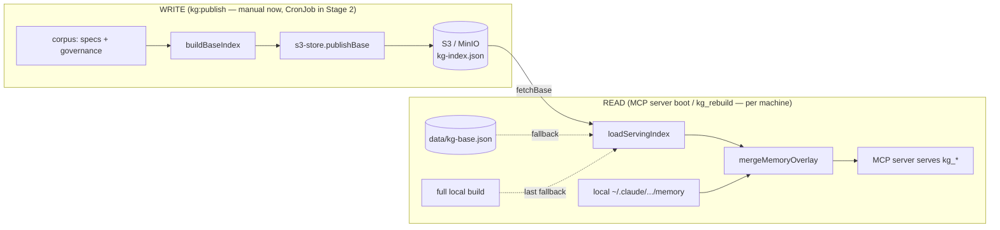

# KG S3-shared index — Stage 1 (local, Docker + MinIO)

> Today the knowledge-graph index is a per-machine local artifact
> (`data/kg-index.json`, rebuilt on demand). Stage 1 makes the **cluster-shared
> part** of it shareable across machines via an S3-compatible object store —
> proven end-to-end locally with MinIO and Docker — while keeping each
> developer's personal memory layer local and private.

## 1. Goal, scope, non-goals

**Goal.** Any machine can fetch the current shared knowledge-graph base from an
S3-compatible store and serve it (merged with its own local memory), and any
machine can publish a freshly-rebuilt base. Prove the mechanism + the
containerized publish job locally with MinIO, with zero cloud dependency.

**In scope (Stage 1).**

- An S3 index store (publish + fetch) in devloop, S3-compatible (MinIO + Infomaniak).
- A memory-free **base** build (`buildBaseIndex`) + a `kg:publish` flow.
- A read path with precedence **S3 -> local cache -> full local build**, plus the
  **shared-base + local-memory overlay** merge, wired into the MCP server.
- A Dockerfile for the rebuild-and-publish job + a local `docker compose` with
  MinIO that runs the whole loop.
- Tests: gated MinIO round-trip, hermetic overlay-merge, fallback-precedence.

**Out of scope (Stage 2+ / deferred).**

- Infomaniak S3 bucket provisioning (terraform) + SOPS-managed cloud creds.
- The K8s CronJob that auto-rebuilds+publishes on a schedule.
- git-clone-in-container corpus access (Stage 1 bind-mounts the host corpus).
- A remote (HTTP/SSE) MCP service. The MCP server stays stdio-local; only the
  *index data* is shared. Embeddings, write-side emit-loop, human viewer — all
  remain deferred per the read-side spec.

## 2. Decisions (settled in brainstorming, 2026-05-31)

| # | Decision | Choice |
|---|----------|--------|
| D1 | What is shared | The **base** index built from the cluster-shared corpus only: specs (ADRs + concepts) + governance (policies/workflows/CLAUDE.md). Memory is NOT shared. |
| D2 | Memory | **Local overlay** — merged client-side at read time onto the fetched base; never published. Keeps the shared artifact reproducible + memory private. |
| D3 | Read precedence | **S3 -> local cache (`data/kg-base.json`) -> full local build.** Fetch-on-boot (artifact ~457 KB, sub-second). Successful fetch refreshes the cache. |
| D4 | Publish trigger (Stage 1) | Manual `kg:publish` CLI. The scheduled auto-publish is Stage 2's CronJob. |
| D5 | S3 client | `@aws-sdk/client-s3` (new dep) — standard, S3-compatible with MinIO + Infomaniak; `forcePathStyle: true` for MinIO. |
| D6 | Local corpus access | **Bind-mount** the host corpus (`layers/specs` + workbench governance) read-only into the container. Stage 2 switches to git-clone (no host). |
| D7 | S3 inactive when unconfigured | If S3 env is unset, the store is a no-op and the read path falls straight through to cache/local-build — Stage 1 never breaks the existing local flow. |

## 3. Architecture

New/changed units under `domains/devloop/src/knowledge-graph/`:

- **`graph/s3-store.ts`** (new) — `publishBase(graph, cfg)` + `fetchBase(cfg): KgGraph | null` over `@aws-sdk/client-s3`. `resolveS3Config(env): S3Config | null` (null when unconfigured). Endpoint/bucket/key/creds/region from env; `forcePathStyle: true`.
- **`index.ts` `buildBaseIndex()`** (new) — like `buildIndexFrom` but **omits the memory reader**: specs + governance only. The memory-free shared base.
- **`index.ts` `mergeMemoryOverlay(base, memoryDir): KgGraph`** (new) — read local memory (`readMemory`), add memory nodes + their `links-to` edges to a copy of `base`, then **re-derive `mentions` for the memory-origin nodes against the merged node set** (reuse the existing mention-derivation), return. Pure given inputs (testable).
- **`index.ts` `loadServingIndex(): KgGraph`** (new) — precedence D3: `fetchBase` (if S3 configured) -> read `data/kg-base.json` cache -> `buildBaseIndex()`; on a successful fetch, write the cache; then `mergeMemoryOverlay`. Replaces `loadOrBuildIndex` as the MCP server's load entry.
- **`cli.ts` `publish` command** (new) — `buildBaseIndex()` -> `publishBase()`; also writes the local cache. Exposed as `npm run kg:publish`.
- **`mcp/server.ts`** — boot + `kg_rebuild` call `loadServingIndex()` instead of `loadOrBuildIndex()`. `kg_rebuild` re-pulls the base (S3 or rebuild) + re-merges memory.
- **`Dockerfile`** (new, `domains/devloop/Dockerfile`) — `node:22-slim`, `npm ci`, entrypoint `npm run kg:publish`. Corpus + S3 config via env/mounts.
- **`docker-compose.kg.yml`** (new, `domains/devloop/`) — `minio` + a `createbuckets` one-shot (`mc mb`) + `kg-publish` (built from the Dockerfile, bind-mounts the host corpus read-only, env points at MinIO).

`loadOrBuildIndex` is retained (used by the gated real-corpus test); `loadServingIndex` is the new serving entry. No existing behavior is removed.

## 4. Configuration

Read from `process.env` (resolved once in `resolveS3Config`):

| var | meaning | local (MinIO) example |
|-----|---------|------------------------|
| `KG_S3_ENDPOINT` | S3 endpoint URL | `http://localhost:9100` |
| `KG_S3_BUCKET` | bucket/container | `kg-index` |
| `KG_S3_KEY` | object key | `kg-index.json` |
| `KG_S3_ACCESS_KEY_ID` | access key | `minioadmin` |
| `KG_S3_SECRET_ACCESS_KEY` | secret | `minioadmin` |
| `KG_S3_REGION` | region (default `us-east-1`) | `us-east-1` |

`forcePathStyle: true` is always set (required by MinIO; harmless on Infomaniak).
MinIO defaults in the compose file are non-secret local credentials. Cloud
Infomaniak credentials via SOPS/age are **Stage 2**. `DEVLOOP_MEMORY_DIR`
continues to drive the local memory overlay (unchanged from the read-side spec).

## 5. Data flow detail

**Publish (`kg:publish`):** read specs + governance -> `buildGraph` (the base, no
memory) -> serialize -> `PutObject` to `KG_S3_BUCKET/KG_S3_KEY` -> also write
`data/kg-base.json` locally (warm the publisher's own cache).

**Serve (`loadServingIndex`):**

1. `cfg = resolveS3Config(env)`. If `cfg` and `fetchBase(cfg)` succeeds -> `base`,
   write `data/kg-base.json`.
2. Else if `data/kg-base.json` exists -> `base` from cache.
3. Else `base = buildBaseIndex()` (full local build; logs that it's offline-local).
4. `return mergeMemoryOverlay(base, memoryDir)`.

A fetch error (network/missing object/bad creds) is caught and treated as
"S3 miss" -> falls to step 2 (never throws on the serving path).

## 6. Local Docker + MinIO loop

`docker compose -f docker-compose.kg.yml up` brings up:

1. `minio` (S3 API on `:9100`, console `:9101`).
2. `createbuckets` — a one-shot `minio/mc` that waits for MinIO then `mc mb`
   the `kg-index` bucket.
3. `kg-publish` — built from `Dockerfile`, **bind-mounts** the cluster root
   read-only (so the container sees `layers/specs` + the workbench governance
   files), env points `KG_S3_ENDPOINT` at the `minio` service, runs `kg:publish`.

Result: the base index lands in MinIO. A developer's local MCP server (with the
same `KG_S3_*` env) then fetches it via `loadServingIndex` and merges local
memory. This is the full multi-machine-sharing loop, proven on one host.

## 7. Testing

The real risks are the S3 round-trip and the overlay-merge correctness.

1. **S3 round-trip (gated).** `KG_S3_TEST=1`-gated (precedent: devloop gates its
   DB test on `DATABASE_URL`): against a MinIO testcontainer (or a running local
   MinIO), `publishBase(g)` then `fetchBase()` returns a graph deep-equal to `g`.
   Skipped in plain `vitest run` so CI without MinIO stays green.
2. **Overlay merge (hermetic).** `mergeMemoryOverlay(base, fixtureMemoryDir)`:
   asserts memory nodes are added, their `links-to` edges present, and a
   **re-derived `mentions`** edge from a memory node to a base node (e.g. a fake
   memory summary mentioning `adr-200`) exists — proving the merge recomputes
   derived edges, not just concatenates.
3. **Precedence/fallback (hermetic).** With S3 unconfigured -> `loadServingIndex`
   builds locally; with a cache file present and S3 forced-miss -> serves cache.
   (Inject env + a temp cache dir; do not hit the network.)

`docker-compose.kg.yml` + the Dockerfile are smoke-verified manually
(`docker compose up` -> object present in MinIO -> a local fetch returns it),
not in CI (no Docker-in-CI; consistent with the read-side real-corpus smoke).

## 8. Governance

No kernel change; devloop stays a correct-minimal pack (ADR-176/192) — the S3
store is a pack-local adapter, not a kernel concern, and adds no NestJS/Postgres/
RLS. "Store generators, derive graphs" holds: the S3 object is a **published
derived projection**, rebuildable from the corpus generators; it is a cache, not
a source of truth (the read path always has the local-build fallback). The
shared/base-vs-local/memory split is the deliberate boundary that keeps the
shared artifact reproducible and personal memory private.

## 9. Relationship to Stage 2

Stage 2 reuses everything here unchanged and adds only infra:

- Provision an Infomaniak S3 bucket via the existing `s3-bucket` terraform module.
- Supply cloud `KG_S3_*` via SOPS/age instead of plain compose env.
- Deploy the **same Docker image** as a K8s **CronJob** (new manifest in
  `layers/platform/k8s/`) that git-clones the corpus and runs `kg:publish` on a
  schedule, so the shared base self-freshens.

Because Stage 1 is endpoint-agnostic (`@aws-sdk/client-s3` + `forcePathStyle`),
the only Stage-2 code delta is the corpus-access switch (mount -> clone), isolated
behind the job's entrypoint.
