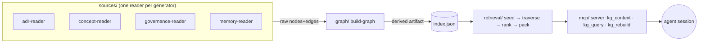

# SDLC Knowledge Graph (read-side) — technical design

> Every session cold-starts: it greps `CLAUDE.md`, reads the memory index,
> navigates to ADRs, hunts policies, and reconstructs *why* a thing is the way it
> is. The knowledge is real and structured but lives as a pile of files each
> session re-discovers. This module derives that knowledge into a navigable graph
> an agent **queries** instead of greps — removing the cold-start tax.

## 1. Scope & rationale

### 1.1 The destination, and the cut

The destination is a **read + write loop**: sessions *read* a knowledge graph to
start oriented, and *emit* into it as they work, so the next session stands on
what the last one learned ("knowledge that evolves"). This document specs the
**read-side only**. The write-side emit-loop is a named phase-2 extension.

### 1.2 Why a devloop module, not a kernel primitive

The substrate kernel is exactly four concerns and is governed by the ADR-176
inclusion test: a thing enters the kernel only if (a) it is one of the four
concerns **and** (b) ≥2 packs need it as shared infrastructure the kernel must
validate/query/version.

This knowledge graph **fails gate (a)**: it indexes *our documents* (ADRs,
policies, memories), it does not model intervention->effect on a domain subject.
It is retrieval/orientation infrastructure. Therefore it is **internal tooling**,
not kernel surface, and it lives in `domains/devloop` because:

- devloop is the self-hosting SDLC consumer; this is a self-hosting SDLC artifact.
- devloop already reads across repos (it backfills PR lifecycle across the cluster).
- devloop owns the append-only event log the **write-side** will fuse into — so
  phase 2 becomes an *extension* of this module, not a cross-repo integration.

The way a capability reaches all upper layers in this cluster is a published
package boundary, not kernel residence — so universality is preserved without
bloating the kernel the cluster works hard to keep minimal.

### 1.3 The load-bearing discipline: derive, do not author

"Store generators, derive graphs." The files (+ git) remain the single source of
truth. The graph is a **projection** built by parsing what we already maintain.
The moment the graph becomes a second artifact a human hand-maintains, it rots.
Done right this is a *build step*, not a new authoring burden — and the edges
already exist (see §3).

## 2. Decisions (settled in brainstorming, 2026-05-31)

| # | Decision | Choice |
|---|----------|--------|
| D1 | Primary job | **Warm session-start context pack + on-demand query** — one derived graph, two agent-facing entry points. No human viewer. |
| D2 | Corpus | **Specs + governance + memory** — ADRs, concept docs, `policies/`, `workflows/`, the `CLAUDE.md` set, and the auto-memory. Activity spine (PRs/commits/sessions) deferred to write-side. |
| D3 | Retrieval engine | **Lexical + tag seeding → typed-edge traversal + ranking.** Embeddings/semantic search deferred (clean later seam). |
| D4 | Consumption surface | **MCP server from day one** — `kg_context`, `kg_query`, `kg_rebuild`. Always-there agent ergonomics. |
| D5 | Home | **`domains/devloop` module.** |
| D6 | Storage | Derived **`index.json`** built in memory (~400 nodes). No graph DB, no watcher daemon. |

## 3. Why this is cheap — the edges already exist

The graph is highly derivable today; nodes are already linked:

- **ADR/concept frontmatter** is a typed citation graph (counts across 201 ADRs):
  `relates-to` ×156, `ratifies` ×60, `amends` ×32, `implemented-by` ×20,
  `superseded-by` ×17, `depends-on` ×15, `supersedes` ×5. Governed by ADR-181.
- **Auto-memory** files declare `metadata.node_type: memory` + `type` +
  `originSessionId`, carry a hand-written `description:` (a relevance summary),
  and link bodies with `[[wikilinks]]`. Many descriptions literally say
  "Read before X work" — a human-authored retrieval trigger.
- **Status fields** (`ratified`/`proposed`/`superseded`/`deprecated`) +
  `superseded-by` let retrieval down-rank stale decisions and auto-surface their
  replacement — "never serve stale knowledge", which file-grep cannot do.

## 4. Architecture

Four small, independently-testable units under
`domains/devloop/src/knowledge-graph/`:



- **`sources/`** — one reader per generator, each emitting raw `{nodes, edges}`:
  `adr-reader`, `concept-reader`, `governance-reader`, `memory-reader`. Readers
  take **configurable root paths** (specs repo, workbench root, memory dir) — the
  corpus spans repos and the memory dir lives outside any repo
  (`~/.claude/.../memory/`). The **workbench root is declarative-only**, so the
  code lives in devloop and reads these roots; it writes nothing back to them.
- **`graph/`** — normalize + merge readers into one typed graph; persist `index.json`.
  Files: `graph-model.ts` (node/edge types), `build-graph.ts`, `index-store.ts`.
- **`retrieval/`** — `seed.ts`, `traverse.ts`, `rank.ts`, `context-pack.ts`.
- **`mcp/`** — `server.ts`, the MCP surface over retrieval.

Data flow: **readers → graph builder → `index.json` → retrieval → MCP result.**
Index built on server start and on explicit `kg_rebuild`.

## 5. Graph model

### 5.1 Nodes

One node per corpus artifact; stable `id` = its slug.

| kind | source | id example | key fields |
|------|--------|------------|------------|
| `adr` | `layers/specs/adr/*.md` frontmatter | `adr-176` | title, status, applies-to, date |
| `concept` | `layers/specs/concepts/**/*.md` | `north-star-vision-capture-2026-05-17` | title, tags |
| `policy` | `policies/*.md`, `workflows/*.md` | `policy-git` | title |
| `instruction` | the `CLAUDE.md` set | `claude-md-root` | scope |
| `memory` | `~/.claude/.../memory/*.md` | `substrate-kernel-state-2026-05-30` | description, type, originSessionId |

Every node also carries:

- `path` — pointer to the file. The graph **links to files, it does not inline
  their contents**.
- `summary` — frontmatter `description:` / first heading / first sentence.

### 5.2 Edges

Typed, directional where the source defines a direction:

- **From ADR/concept frontmatter:** `relates-to`, `depends-on`,
  `supersedes`/`superseded-by`, `amends`, `ratifies`/`ratified-by`,
  `implemented-by`.
- **From memory bodies:** `[[wikilink]]` → `links-to`.
- **Derived at build (cheap, deterministic — no embeddings, no co-occurrence
  guessing):** `mentions` (a node body references another node's id);
  `applies-to-area` (node → area tag, e.g. `substrate`).

A dangling edge (target id not in the graph) is recorded as a **build warning**,
not dropped silently — a stale cross-reference is signal worth surfacing.

## 6. Retrieval & output contract

### 6.1 `kg_context(task)`

1. **Seed** — score every node by lexical/tag overlap of `task` against
   `title` + `tags` + `applies-to` + memory `description`. Take top-K seeds.
2. **Expand** — walk typed edges up to N hops (default 2) from seeds; collect
   reached nodes *with the path taken*.
3. **Rank** — composite of: seed match strength + edge proximity (closer ranks
   higher) + **status weight** (`ratified` > `proposed`; `superseded`/`deprecated`
   heavily penalized but still shown *with a pointer to the successor*) + recency.
4. **Assemble a token-bounded context pack** — not a file dump:

```
TASK: "touch kernel persistence"
RULES:      policy-git, policy-testing                    (governance you must follow)
DECIDED:    adr-176 (kernel minimality) · adr-200 (effect persistence, ratified)
            WARN adr-153 superseded-by adr-200 — use adr-200
LEARNED:    [[substrate-kernel-state-2026-05-30]] "Read before any kernel-persistence work"
WHY THESE:  adr-200 ←implemented-by→ substrate#63 ; memory →links-to→ adr-200
FILES:      layers/specs/adr/adr-200-*.md , ...           (open these for detail)
MORE:       7 further nodes within 2 hops — kg_query to expand
```

The **WHY THESE** edge-path line is the trust mechanism: the agent sees *why*
each node surfaced and can judge it. The pack is **token-bounded** (a `budget`
arg with an "N more" pointer) so it never blows context — it removes the
cold-start tax without recreating it.

### 6.2 `kg_query(...)`

The same engine with explicit knobs: `{ from?: node-id, edge?: type, hops?: N,
text?: string, status?: ... }`. Serves "what supersedes X", "what depends on
adr-176", "what bears on this file/area".

## 7. MCP surface

| tool | signature | returns |
|------|-----------|---------|
| `kg_context` | `(task: string, budget?: number)` | context pack (§6.1) |
| `kg_query` | `({ from?, edge?, hops?, text?, status? })` | ranked subgraph |
| `kg_rebuild` | `()` | re-derive `index.json`; report node/edge counts + warnings |

Registered once in `settings.json`. Built and run from `domains/devloop`.

## 8. Freshness

- Rebuild on server start and on `kg_rebuild`.
- A commit-hook rebuild is a cheap later add (deferred — the corpus changes
  slowly and an explicit `kg_rebuild` covers the in-session case).

## 9. Testing — keep retrieval honest

The real risk is **retrieval quality**, not plumbing. Tiers:

1. **Golden-query fixtures** — ~12 hand-labeled `(task → expected-must-include
   node ids)` cases, asserted on every build. Example: `"kernel persistence"`
   must surface `adr-176`, `adr-200`, and `substrate-kernel-state-2026-05-30`;
   must *not* rank a `superseded` node above its successor. These are the
   regression net for the engine and the tripwire for "lexical recall is no
   longer enough → time to add embeddings."
2. **Per-reader unit tests** — frontmatter parsing, wikilink extraction, slug/id
   derivation, status normalization.
3. **Graph-integrity test** — every `superseded-by` has a target; dangling edges
   are reported (not thrown); ids are unique.

## 10. Out of scope (named phase-2+ extensions, not deletions)

- **Write-side emit-loop** — sessions emitting decisions/forks/outcomes into
  devloop's event log so the graph becomes a projection over *corpus + activity*.
- **Embeddings / semantic search** — the seam is the seed-finding step (§6.1.1);
  added when golden-query recall visibly falls short.
- **Human-navigable viewer** — the Strain-style phylogeny/graph a person explores.
- **Activity spine** — PRs, commits, sessions as nodes.

## 11. Relationship to Strain / the Knowledge Evolution Platform

This is the Strain MVP wedge ("AI-SDLC playbooks") pointed at the one customer we
fully control: ourselves. The read-side proves the orientation value on our own
corpus with near-zero authoring cost. If a second consumer ever pulls on
cross-org subtree sharing, *that* is when the published-subtree registry
(north-star §4d) earns a kernel/product conversation — demand-driven, per ADR-176.
This module deliberately does not pre-build that.
