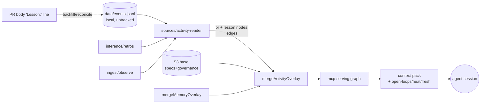

# SDLC Knowledge Graph (write-side emit-loop) — technical design

> The read-side answers *"what do the specs say about X?"*. It cannot answer
> *"what did we recently decide or ship that bears on X, and what did we learn
> doing it?"* — because that knowledge lives in the activity stream, not the
> corpus. This phase projects that stream into the graph so every session inherits
> the last session's lessons, open loops, and freshness signals.

## 1. Scope & the load-bearing reframe

### 1.1 A pile of PRs is history, not knowledge

The naive write-side mints one graph node per PR and calls it done. That produces
400 `pr#NNN merged` nodes — *events with timestamps*, sitting as noise next to a
corpus that carries actual positions. A PR node, raw, has none of the three
properties that make the corpus side valuable:

1. **Position, not events** — the corpus tells you the *current authoritative
   answer* (the ratified ADR) and, via `supersedes`/`superseded-by`, what
   replaced what ("never serve stale").
2. **Typed meaning → trust** — edges carry semantics (`amends`,
   `implemented-by`), so retrieval explains *why* a node surfaced.
3. **A relevance trigger** — the hand-written `description:` ("Read before X work").

### 1.2 The reframe: make activity perform the corpus's move

The corpus derives a **current-state view from a history of changes**. The
write-side does the *same move* on the activity stream. Activity contributes three
**derived-knowledge layers**, and the PR node demotes to **provenance** — the
WHY-THIS trail (you trust a lesson because you can see the PR + verdict it came
from), the activity-side analogue of the corpus's edge-path.

| Layer | What it is | Generator (already exists) | Corpus analogue |
|---|---|---|---|
| **Lessons** | The knowledge payload: a `RetroSignal` note (friction/win/improvement) + the new `Lesson:` PR-body line. Attached to the ADR/area it bears on. | `inference/retros.ts → retros()` | memory `description:` "read before X" |
| **Open loops** | Outstanding *actionable* knowledge the corpus cannot hold: unapplied improvements, declared-but-unobserved effects, founder corrections/overrides. | `retros().openImprovements` + `ingest/observe.ts` (declared ∖ observed) | (none — activity-only) |
| **Freshness / heat** | Recent activity on an ADR's area = "this decision is *live, being acted on*"; the latest lesson per area supersedes older ones. | derived over PR/merge event dates | `status` weight + `superseded-by` |

The result: `kg_context("touch kernel persistence")` stops emitting
`RECENT: pr#248, pr#247…` and starts emitting knowledge:

```text
LEARNED (recent, 'substrate inference'):
  • fixtures ≠ real corpus — verify against the real corpus, not fixtures   [specs#248 friction]
OPEN LOOPS:
  • effect 'coverage +4±2' declared on specs#248 — not yet observed
  • improvement 'add distractor golden fixtures' — unapplied                [devloop#33]
FRESH: adr-203 ratified + shipped specs#248 (2d ago) — live
```

### 1.3 The critical placement fact: local overlay, not shared base

**`data/events.jsonl` is not git-tracked.** The Stage-2 CronJob builds the shared
S3 base from a *git clone*, which therefore contains no event log. Activity
**cannot** ride the shared base without changing the image + committing the log —
both out of scope. And it should not: the event log is machine-local.

So activity is a **local overlay** (`mergeActivityOverlay`), mirroring the
existing `mergeMemoryOverlay`. It is nonetheless *effectively shared* across
machines, because lessons / effects / PRs are **re-derivable from public PR
bodies** via `backfill` + `reconcile` (deterministic, idempotent — see §6). Only
hand-authored memory `.md` remains truly personal. **The CronJob, the image, and
the S3 base are untouched.**

## 2. Decisions (settled in brainstorming, 2026-06-01)

| # | Decision | Choice |
|---|----------|--------|
| D1 | Capture model | **Project + redirect lessons.** Activity nodes are a projection of the event log; the only new write path is a structured `Lesson:` PR-body line parsed like `Effect:`/`Producer:`. No hand-authored memory files required. |
| D2 | Node granularity | **One node per PR (provenance, low weight) + lesson nodes (knowledge, high weight).** Open-loops / heat / freshness are *derived at pack-time*, not stored as a sprawl of nodes (ADR-176 minimality). |
| D3 | Placement | **Local activity overlay** (`mergeActivityOverlay`), not the shared S3 base. Convergent across machines via re-derivation from public PRs. |
| D4 | Linking | **Reuse `deriveMentionEdges`** (summary → `adr-NNN`) + `applies-to-area` (repo → area) + one new `evidenced-by` edge (lesson → pr provenance). |
| D5 | Freshness / dedup | **Window** PR nodes to recent (default 60d, configurable); **dedup** by deterministic node id; open-loops / heat computed at pack-time against the current date. |
| D6 | Capture trigger | **Derive, don't author.** `Lesson:` PR-body line parsed in `backfill`; existing `retro` CLI still works; `kg_rebuild` / server-start re-reads the local log. No hooks, no manual graph authoring. |

## 3. Why this is cheap — the generators already exist

The knowledge-extraction is not new code; it is `src/inference/` and `src/ingest/`
that devloop already runs for calibration:

- **`retros()`** (`inference/retros.ts`) already aggregates `RetroSignal` events
  and already computes `openImprovements` (improvement-kind with no `appliedRef` =
  the actionable backlog). → lesson nodes + the "unapplied improvement" open loop.
- **`reconcileObservations()`** (`ingest/observe.ts`) already finds declared
  effects with no matching observation. → the "unverified claim" open loop.
- **`deriveMentionEdges` / `deriveAreaEdges`** (`graph/build-graph.ts`) already
  link nodes to `adr-NNN` and to areas by scanning `summary` / `path`. → activity
  links to corpus for free.
- **`mergeMemoryOverlay`** (`knowledge-graph/index.ts`) is the exact pattern the
  activity overlay copies (add nodes + edges, re-derive `mentions` from the new
  nodes against the merged set).

The write-side is *projection plumbing over existing inferences*, plus one PR-body
parser.

## 4. Architecture

One new source unit, one new overlay function, and additive edits to the model /
rank / pack. Nothing in the base-build or publish path changes.



Serving precedence is unchanged (**S3 base → cache → local build**); the activity
overlay is merged *after* the base, alongside the memory overlay:

```text
loadServingIndex():
  base = S3 → cache → buildBaseIndex()
  base = mergeMemoryOverlay(base, memoryDir)     // existing
  base = mergeActivityOverlay(base, logPath)     // NEW
  return base
```

## 5. Graph model additions

### 5.1 Nodes (additive to `NodeKind`)

| kind | source | id | key fields |
|------|--------|-----|------------|
| `pr` | `PrMerged`/`PrOpened` events | `de-braighter/specs#248` | title, status (`merged`/`open`), summary (title + verdict + producer + any unobserved-effect note), date (mergedAt), tags `['activity','pr', area?]` |
| `lesson` | `RetroSignal` events (CLI **or** parsed `Lesson:` line) | `lesson:de-braighter/specs#248#0` | title (note, truncated), status (`open` if improvement w/o `appliedRef`, else `unknown`), summary (full note), date, tags `['activity','lesson',<kind>, ('open')?]` |

`status` gains two activity values (additive to `NodeStatus`): `open`, `merged`.
`STATUS_WEIGHT`: `open` ranks **high** (surface outstanding loops), `merged`
neutral. PR nodes additionally get a low *kind* weight in rank (§7); lesson nodes
a high one.

Open-effects and corrections/overrides are **not** their own nodes — they are
folded into the relevant `pr` node's `summary` (e.g. `⚠ effect coverage declared,
unobserved`; `⚠ founder override on verifier X`) so the WHY-THIS trail stays on
one provenance node. Minimality: store the generator, derive the annotation.

### 5.2 Edges

- **`mentions`** (reuse, auto) — `pr`/`lesson` summary contains `adr-NNN` → edge to
  that ADR. This is the primary corpus link, especially for `specs` PRs (a specs PR
  mentioning `adr-203` reaches `substrate` in 2 hops via the ADR's own
  `applies-to-area`).
- **`applies-to-area`** (reuse) — `pr`/`lesson` → `area:<x>` from a **repo → area**
  map (`de-braighter/substrate → substrate`, `…/exercir → exercir`, etc.; `specs`
  has no direct area and relies on `mentions`).
- **`evidenced-by`** (NEW, lesson → pr) — provenance: a lesson points at the PR it
  was captured on. Carries the WHY-THIS trail to the context pack.

`mentions` for overlay nodes are re-derived against the merged node set (exactly as
`mergeMemoryOverlay` does), so an activity node referencing `adr-203` links to the
real base node. Dangling refs (`specs#248` style, or an ADR not in the base) are
already tolerated by `EXTERNAL_REF_RE` / dangling-warning handling.

## 6. Capture: the `Lesson:` convention (the only new write path)

A PR-body line, parsed in `backfill` exactly like `Effect:` / `Producer:`:

```text
Lesson: <kind> — <note>
```

- `<kind>` ∈ `friction | win | improvement` (default `friction` if omitted).
- separator tolerant of `—`, `-`, `:`.
- **Left-anchored** (start-or-whitespace) so substrings (e.g. `Anti-Lesson:`)
  cannot fabricate an event — same hardening as `PRODUCER_RE`.
- Maps to a `retro()` envelope: `{ repo, pr, kind, note, by }`, where `by` is the
  producer parsed from the same body's `Producer:` line, else `'session'`.

Examples:

```text
Lesson: friction — fixtures ≠ real corpus; verify against the real corpus, not fixtures
Lesson: improvement — add distractor golden fixtures to the KG retrieval suite
Lesson: win — local activity overlay needs zero CronJob change
```

This is the redirect: the lesson rides the PR body the session is already writing.
No separate memory `.md`, no manual graph authoring. The existing `retro '{…}'`
CLI remains for out-of-band/3rd-party retros (R11: retro-er ≠ producer).

**Idempotency / convergence.** A `RetroSignal` aggregate id is `prAggregateId(repo,
pr)` (deterministic). Lesson **node** ids are `lesson:<repo>#<pr>#<idx>` (stable
per body order). Re-running `backfill` on any machine re-derives identical events
from the same public PR bodies; `buildGraph` already dedups nodes by id. So the
overlay converges across machines without pushing the event log. (Effect
declarations already backfill this way today.)

## 7. Retrieval & output contract

`kg_context` / `kg_query` engine is unchanged in shape; three additive behaviours:

1. **Rank** gains a *kind weight*: `lesson` high, `pr` low — so a relevant lesson
   outranks the PR it came from, and PR nodes act as the trail rather than the
   destination. Recency already factors in (read-side §6.1.3); for activity it is
   weighted up.
2. **Context pack** gains sections derived at pack-time from the ranked set + node
   dates/tags (no raw-event access needed — the graph carries dates + `open` tags):
   - **LEARNED** now includes `lesson` nodes (alongside memory), newest-first,
     latest-per-area wins (older lessons down-rank — the activity `superseded-by`).
   - **OPEN LOOPS** — `lesson` nodes with status `open`, plus `pr` summaries
     flagged with an unobserved-effect / override warning, within the window.
   - **FRESH / HEAT** — an ADR/area with an incoming `mentions`/`applies-to-area`
     edge from a `pr` node dated within the window is annotated "live (N PRs, Md)".
3. **Window** — activity nodes older than `ACTIVITY_WINDOW_DAYS` (default 60) are
   dropped at overlay-build (open improvements are kept regardless of age — an
   unapplied lesson does not expire). Keeps the overlay small and the pack recent.

`kg_query` transparently gains the new kinds/edges (`from: 'adr-203', edge:
'mentions'` now also reaches the PRs that shipped it).

## 8. Testing — keep the projection honest

Mirrors the read-side tiers; all under `test/knowledge-graph/`, ESM `.js` imports,
`noUncheckedIndexedAccess`-clean.

1. **`Lesson:` parser unit tests** — kind defaulting, separator tolerance,
   left-anchor hardening (no fabrication from `Anti-Lesson:`), `by` resolution from
   a co-located `Producer:` line.
2. **`activity-reader` unit tests** — a fixture `events.jsonl` → expected pr +
   lesson nodes; open-improvement → `status:'open'`; declared-without-observed →
   pr-summary warning; window drops old PRs but keeps open improvements;
   deterministic ids → idempotent re-read dedups.
3. **`mergeActivityOverlay` tests** — nodes/edges added; `mentions` re-derived
   (a lesson mentioning `adr-203` links to the base node); base + memory untouched.
4. **Golden retrieval cases** — extend the read-side golden suite: `"kernel
   persistence"` must now surface the kernel-state **lesson** and any **open
   improvement** on that area, must rank the lesson above its provenance PR, and
   must not rank a stale (windowed-out) PR above a current lesson.
5. **Pack-annotation tests** — OPEN LOOPS / FRESH sections render from a crafted
   graph; an ADR with a recent mentioning PR is flagged "live".

## 9. Constraints honoured

- **No kernel change** — pure devloop module; events remain pack-namespaced
  `DomainEventEnvelope`s (ADR-027/030). ADR-176 inclusion test still fails on
  purpose → internal tooling.
- **Image / base / CronJob unchanged** — activity is a local overlay; the S3
  publish path (`buildBaseIndex` → `publishBase`) is not touched.
- **Reuse Stage-1 machinery** — `mergeMemoryOverlay` pattern, `deriveMentionEdges`,
  `retros()`, `reconcileObservations`, `backfill` parser pattern.
- **ESM `.js` imports, `noUncheckedIndexedAccess`, `test/knowledge-graph/`,
  English.**
- **Sonar-green discipline** — own-code 0 new violations; the parser regex gets the
  same S5852-hotspot review as the existing `EFFECT_RE`/`PRODUCER_RE`.

## 10. Out of scope (named follow-ups, not deletions)

- **Cross-machine shared activity in the S3 base** — would require committing
  `events.jsonl` (or a published activity artifact) + an image/CronJob change.
  Deferred; the local overlay + public-PR convergence covers the read+write loop
  today.
- **Session-level nodes** — a "session" as a first-class node (vs. PRs + lessons).
  Not needed for orientation; revisit if session-spanning narrative is wanted.
- **Hook-based capture** — a `Stop`/`SubagentStop` hook auto-emitting lessons from
  the transcript. The `Lesson:` PR-body convention is the cheaper first cut;
  hooks are a later automation if the convention proves too manual.
- **Embeddings / human viewer / the Strain marketplace** — unchanged from the
  read-side spec's deferral list.
