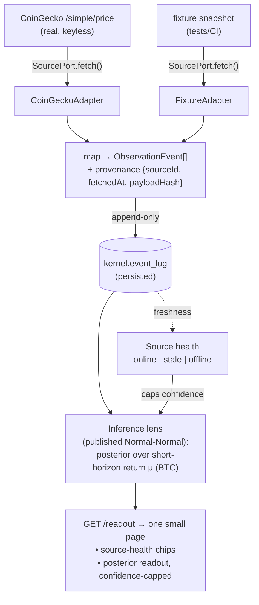

# Markets domain — external-source integration demonstrator (slice 1)

> Markets are the cleanest possible illustration of "you declare the data": a
> readout is only as trustworthy as the feeds under it. This slice builds the
> smallest honest version of that — a real external price feed recorded into the
> substrate's append-only log, a real posterior computed over it, and a
> confidence number that is *visibly capped when the source goes stale*. The
> integration plumbing (declare a source → adapt it → ground observations →
> track provenance → gate confidence) is the reusable asset; crypto is just the
> first consumer.

## Purpose & framing

`domains/markets/` (repo `de-braighter/markets`) is a new substrate domain whose
reason to exist is to **demonstrate governed external-source integration** on the
platform. Two things ship, with different lifespans:

1. **The source spine** (`libs/source-spine`, working name) — the reusable
   capability: a `SourcePort` contract, per-source adapters, provenance capture,
   and source-health → confidence gating. It carries **no market knowledge**.
2. **The markets pack** (`libs/markets-pack`) — the demo consumer: declares the
   CoinGecko source, maps its payload to substrate observation events, runs one
   inference lens, and exposes the readout.

The spine is the genuinely reusable IP and the long-term bet; the markets pack is
the proof it works end-to-end.

## Definitions

- **Source** — a declared external feed (provider, category, latency, coverage,
  `required` flag). Mirrors the prototype's `SOURCES`.
- **`SourcePort`** — the contract every adapter implements: `fetch()` →
  typed raw payload + a health signal. The boundary that isolates the messy
  external edge from the reproducible core.
- **Adapter** — a concrete `SourcePort` implementation for one provider
  (`CoinGeckoAdapter`, `FixtureAdapter`).
- **Observation event** — a substrate-shaped, append-only record derived from a
  source payload, carrying provenance (`sourceId`, `fetchedAt`, `payloadHash`).
  Persisted to `kernel.event_log`.
- **Source health** — `online | stale | offline`, derived from feed freshness vs.
  a declared latency budget.
- **Confidence gate** — the rule that a `required` source which is stale/offline
  caps the readout's reported confidence. The product expression of the kernel's
  reproducibility contract.
- **Inference lens** — a single probabilistic readout over the recorded
  observations (slice 1: a posterior over short-horizon return for one asset).

## Decisions (settled in brainstorming)

| # | Decision | Rationale |
|---|----------|-----------|
| D1 | Purpose = **capability demonstrator**; spine is the deliverable, markets is the consumer | Keeps focus on the reusable integration pattern; respects the prototype concept doc's "do not redesign substrate around finance / keep exploratory" caution |
| D2 | First source = **real CoinGecko** (keyless, public) + a **fixture adapter** behind the same port | Makes "integrates external sources" literally true and forces real-world latency/error handling, while keeping tests deterministic and offline |
| D3 | Slice-1 surface = **runtime backend + thin `GET /readout` + one small page** | Real, growable domain (not a throwaway), but no full Angular cockpit before the pattern is proven |
| D4 | Coupling = **full runtime** (`substrate-contracts` + `substrate-runtime`, persisted `kernel.event_log`, published Normal-Normal backbone) | The founder chose a real substrate domain over a runtime-light demo — external source → persisted observation → real posterior, not simulated |

## Architecture

### Ring placement & kernel posture

Pack-on-platform (Ring 4/5), **zero kernel change**. The new concepts
(feeds-as-observations, whales-as-interventions, source catalog) are pack
representation living in typed pack libs + `metadata` JSONB. The spine itself
**fails the ADR-176 inclusion test today** — it is needed by *one* pack (markets),
not ≥2 — so it stays pack-local. It is *designed* for promotion but is not
promoted speculatively.

### Libraries

```text
domains/markets/                      (nx workspace, repo de-braighter/markets)
├── libs/source-spine/                reusable capability — NO market knowledge
│   ├── source-port.ts                SourcePort contract + types
│   ├── provenance.ts                 hash + fetchedAt capture
│   ├── source-health.ts             freshness → online|stale|offline
│   └── confidence-gate.ts            required-source health → confidence cap
├── libs/markets-pack/                demo consumer
│   ├── sources/coingecko.adapter.ts  real SourcePort impl (live)
│   ├── sources/fixture.adapter.ts    recorded snapshot (tests/CI)
│   ├── observations.ts               payload → ObservationEvent[] mapping
│   └── lens/return-posterior.ts      wires recorded obs → Normal-Normal backbone
└── apps/markets-api/                 substrate-runtime (NestJS) host
    ├── main.ts / app.module.ts       SubstrateModule.forRoot({...}) + demo tenant
    ├── readout.controller.ts         GET /readout
    └── public/index.html             one small live page
```

### Runtime

`apps/markets-api` is a `@de-braighter/substrate-runtime` (NestJS) host wired via
`SubstrateModule.forRoot({...})`: Postgres-persisted `kernel.event_log`, a
`DEMO_TENANT_PACK_ID` context, and the two-role RLS seed — the herdbook-E1 /
exercir foundation pattern, which is a known path.

## Data flow (slice 1)



Scope knobs are pinned to **one each**: one asset (BTC), one source (CoinGecko),
one inference lens. This keeps the slice thin *within* the full-runtime archetype.

## The inference lens (slice 1)

The lens uses the published **scoped `/inference` `INFERENCE_BACKBONE`**
(Normal-Normal conjugate fast-path, ADR-203 S5 — not the legacy root port). It
maintains a posterior over a latent short-horizon **return** parameter μ for BTC,
updated from price-derived observations recorded in the log. The **confidence
gate** is the punchline and ships in slice 1: when the `required` CoinGecko source
is stale/offline (including a 429 rate-limit treated as "degraded"), the readout's
reported confidence is visibly capped — "you declare the data," made literal.

## Reproducibility & testing

- **Live at the edge, reproducible at the core.** The adapter fetches live for the
  demo, but everything downstream runs off the *recorded* observation log, so a
  replay over a log window is deterministic. The live fetch is the only
  non-reproducible step, and it is quarantined behind `SourcePort`.
- **Two adapters, one port.** `CoinGeckoAdapter` (live) and `FixtureAdapter`
  (recorded snapshot) — tests/CI use the fixture and never touch the network. This
  also proves the port boundary is the right shape.
- **Provenance on every observation** (`payloadHash` + `fetchedAt`) — the seam a
  later signed-evidence / audit slice attaches to.

## Slice 1 scope

**In:** `SourcePort` + provenance + source-health + confidence-gate; CoinGecko
adapter (live) + fixture adapter; observation mapping; persisted `kernel.event_log`
ingestion; one Normal-Normal lens (BTC return posterior); `GET /readout` + one
small live page; deterministic fixture-based tests; demo-tenant + RLS wiring.

**Out (YAGNI — natural later slices):** actors/interventions; scenarios
(counterfactual sandbox — the substrate already supports it); signals (forward
cockpit); replays UI; multi-source; multi-asset; the full Angular cockpit;
persisted source-catalog config; blockchain / provenance signing.

## The graduation path

The spine is built behind a clean `SourcePort` so it *can* move, but it moves only
on evidence. Promotion trigger: a **second** consumer needs declared-source →
observation ingestion. Likely target then = `layers/foundation` (shared package)
or `substrate-contracts` if the observation/provenance shape proves kernel-worthy
under the ADR-176 inclusion test. Until then it stays in `domains/markets`.

## Open questions / risks

### Q1 — Inference stack selection

The published substrate ships two inference stacks (legacy root
`INFERENCE_BACKBONE_PORT` without counterfactual; scoped `/inference`
`INFERENCE_BACKBONE` with it). Slice 1 uses the **scoped** one and reads the
installed `.d.ts` (the layers source can drift). The plan must pin the exact
import surface against the installed package, not from memory.

### Q2 — CoinGecko rate limits

Free tier is keyless but rate-limited. Cache the last good fetch; treat a 429 as
`source: degraded`, which *exercises* the confidence gate rather than breaking the
demo (a feature, not a bug).

### Q3 — Demo tenant + RLS

Needs a `DEMO_TENANT_PACK_ID` and the two-role seed, mirroring exercir/herdbook.
The plan reuses the herdbook-E1 foundation recipe (kernel schema + RLS + `forRoot`
wiring; watch the published-kernel-consumption gotchas: exports-map resolution,
test-doubles at the `/testing` subpath, multiSchema migrate-diff/deploy).

### Q4 — Naming

`source-spine` is a working name. Alternatives: `external-sources`, `ingestion`,
`sources`. Decide at scaffold time; it is the eventual shared-layer package name.

## Related

- ADRs: [ADR-176](../../layers/specs/adr/adr-176-substrate-kernel-minimality-inclusion-test.md)
  (kernel minimality + inclusion/promotion test) ·
  [ADR-027](../../layers/specs/adr/adr-027-pack-architecture.md) (pack architecture / pack-on-platform) ·
  [ADR-203](../../layers/specs/adr/adr-203-wire-inference-to-observation-log-and-second-conjugate-family.md)
  (inference ↔ observation-log wiring; Normal-Normal fast-path) ·
  the ADR-206 line of work (`kernel.event_log` distribution to packs — in flight on the `specs-wt-206` worktree, not yet on `specs` main)
- Precedents: [devloop pack technical design](./2026-05-29-devloop-pack-technical-design.md)
  (pure-TS substrate consumer) · herdbook E1 foundation (published-kernel
  consumption recipe)
- Origin artifact: `markets.zip` — "Substrate Markets" prototype (founder Downloads)
