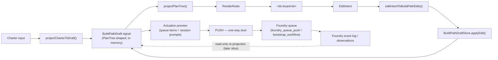

# System Builder Studio — Build Path Designer Design Note (Slice 1)

> Status: **draft** (design-first, pre-implementation). Origin: `docs/foundry-studio-fusion-handover.md`.
> Decision basis: founder locked the three core forks on 2026-06-21 (see §Locked Decisions).
> **Renamed 2026-06-21:** the product is **System Builder Studio** (Foundry key
> `system-builder-studio`); the Build Path Designer described here is its **slice 1**.

## Name

**System Builder Studio** — slice 1 is the **Build Path Designer**: a focused authoring
surface inside `domains/studio` for turning a product charter into a Foundry build path,
visually, then pushing it to the Foundry queue. **Not** a full IDE.

## Locked Decisions (founder, 2026-06-21)

| Fork | Decision | Consequence |
|---|---|---|
| **1. Representation** | **Editable draft projection** | Studio projects Foundry's build-path into a `PlanTree`-shaped *draft* it edits freely; Foundry stays the single source of truth; commit actuates. |
| **2. Actuation boundary** | **Push-to-queue = one-way door** | All edits are a reversible Studio-side draft; a single explicit *Push to Foundry* is the only state-writing actuation. |
| **3. Founder gates** | **Explicit gate nodes** | A founder gate is a first-class node on the canvas, mapping to Foundry's `request-gate` plan-tree intervention. |

The three compose into one story: **edit a draft projection → gates are visible nodes → push is the one-way door.**

## Scope

- `domains/studio` (the `studio-ui` Angular app) — the authoring surface.
- Read/write **integration points** with Foundry, reached only through Foundry's public
  surface (MCP / CLI: `foundry_queue_push`, `foundry_bootstrap_workflow`, …), never its internals.

## Non-goals (slice 1)

- Full IDE, code editor, or live worker-orchestration UI.
- Arbitrary workflow editor.
- Live-substrate DB wiring (draft stays in-memory — see Open Question #7 resolution).
- Recipe-Designer-driven node editors (future path, §Forward references).
- Editing queue/claim/observation state inside Studio (read-only projection only, if shown at all).

## Primary workflow

```
Charter (charter-shaped product description)
   → import / load into Studio
   → visual BuildPathDraft on <ds-board-kit>
   → author epics, work-items, dependencies, lanes, gates; attach scope + quality
   → disjointness panel resolves scope conflicts
   → prompt-preview panel shows the worker-session prompts Foundry would generate
   → PUSH (the one-way door) → Foundry queue
```

## Domain model (Open Question #1 resolution)

A `BuildPathDraft` is a **strictly single-parent tree** of typed `BuildNode`s — the same
shape Studio already edits, so the existing two-trees loop is reused unchanged.

```
BuildNode {
  id: PlanNodeId
  kind: 'goal' | 'epic' | 'work-item' | 'gate'   // typed, kernel-PlanTree-compatible
  label: string
  // --- everything below is per-node METADATA, never kernel structure (ADR-176) ---
  scope?:            ScopeSpec      // path globs / disjointness key (work-item only)
  qualityObligation?: QualitySpec   // tier → battery config, derived from charter risk tier
  dependsOn?:        PlanNodeId[]   // DERIVED edges to sibling nodes — references, never multi-parent
  gate?:             GateSpec       // founder-gate metadata (gate node only)
}
```

- **Structure** (`id`, `kind`, parent link, `label`) → kernel `PlanTree` (typed, single-parent).
- **Operational fields** (`scope`, `qualityObligation`, `dependsOn`, `gate`) → metadata JSONB +
  derived views. `dependsOn` is a sibling-id reference (a derived DAG edge), satisfying the
  charter's "cross-tree relationships are references or derived views, never multi-parent."
- **Lanes** are a grouping *tag/derived view* over disjoint scopes, not a node kind.

## Data flow

Mirrors Studio's existing edit loop; the only new pieces are the charter→draft projector
and the draft→Foundry actuator at the commit line.



**Persistence boundary:** everything left of `PUSH` is reversible Studio-local draft state.
`PUSH` is the single audited Foundry actuation. Nothing right of `PUSH` is ever copied back
into Studio as authoritative state.

## UX surfaces

| Surface | Purpose |
|---|---|
| **Tree canvas** (`<ds-board-kit>`) | Author the build-path structure; gate nodes render distinctly. |
| **Node inspector** | Label, kind, `dependsOn`; for work-items: scope + a *compact* quality summary (not a form). For gate nodes: gate metadata. |
| **Disjointness panel** (#4) | Computes scope overlaps across work-items; flags conflicting nodes with a clash badge; **blocks push while unresolved** (Foundry requires a disjointness proof for parallelism). |
| **Quality-obligations summary** (#5) | Per-node quality derived from the charter's risk tier; one editable knob (effort tier light/standard/deep); avoids a form-heavy admin feel. |
| **Prompt-preview panel** | Renders the worker-session prompts Foundry *would* generate — preview before commit. |
| **Push action** | The one-way door; disabled while disjointness conflicts exist. |

## Governance

- **Zero kernel change** target: structure reuses the kernel `PlanTree`; all operational
  fields are metadata + derived views. No primitive is promoted to the kernel unless the
  ADR-176 inclusion test is *clearly* met (it is not, for this slice).
- **Two-trees discipline preserved** (ADR-239/240): the draft is truth, `RenderNode` is a
  derived projection, layout geometry is never persisted (`move` maps to no edit).
- **Single actuation seam**: Foundry state changes only via the explicit push, through
  Foundry's public surface — Studio is never coupled to Foundry internals (#7).
- **Founder gates are structural**: gate nodes map to Foundry `request-gate`; the
  founder-gated invariant (only the founder's decision passes a gate) is preserved Foundry-side.

## Open-question dispositions

| # | Question | Disposition |
|---|---|---|
| 1 | Minimal domain model | `BuildPathDraft` of typed `BuildNode`s (above). |
| 2 | PlanTree-direct vs projection | **Projection** (locked Fork 1). |
| 3 | Edit-vs-actuate boundary | **Push** (locked Fork 2). |
| 4 | Disjointness visualization | Side panel + clash badges; blocks push. |
| 5 | Quality obligations in inspector | Compact derived summary + one effort knob. |
| 6 | Founder gates UI | **Explicit nodes** (locked Fork 3). |
| 7 | Smallest live-substrate integration | Draft in-memory; only live wire is `foundry_queue_push` on commit. Proves the port-swap seam (store stays kernel-shaped) without coupling to Foundry internals. |
| 8 | Recipe Designer relationship | Non-goal for slice 1; future path = author the build-node inspector editors as Recipe data. |

## Forward references (not this slice)

- Read-only re-projection of Foundry observations/claim-state back onto the draft (close the loop).
- Recipe-Designer-authored node editors → a recipe-driven build-path designer.
- Live-substrate store swap (the in-memory `BuildPathDraftStore` → a kernel-backed one).

## Suggested next step

Implementation plan for slice 1 (`writing-plans` → subagent-driven execution), decomposed as:
charter-import projector · `BuildPathDraft` model + store · board-kit binding (reuse studio loop) ·
inspector (scope + quality + depends-on + gate) · disjointness panel · prompt-preview panel ·
push actuator (`foundry_queue_push`). Designer-first review wave before merge per the de-braighter floor.
