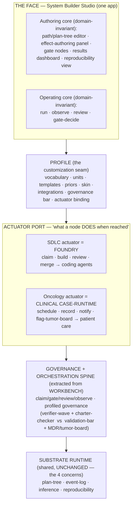

# System Builder Studio — the fusion (workbench · foundry · studio)

> **Masterplan / founder input.** This note is the upstream artifact `/build-path` decomposes
> into claimable Foundry work items. It captures the *what* and *why*; the build-path captures
> the *how*.

## 1. Thesis

**System Builder Studio is one product with one face**: a studio where a domain expert authors a
*workflow/path as a runnable system* — a single-parent tree of interventions → outcomes, carrying
predicted effects and gates — and then **operates** it. The substrate runs it (events, inference,
reproducibility); a **per-profile actuator** decides what each node *does* when reached.

Swap the **profile** and the same tool becomes a different product:

- **SDLC profile** → Foundry actuates: `claim · build · review · merge` → coding agents build software.
- **Oncology profile** → a clinical case-runtime actuates: `schedule · record · notify · flag-tumor-board`
  → patients move through care.

Both are the same act: *define workflows/paths as systems, then run them with rigor (validated,
observable, reproducible).*

### Strategy — productize what exists, then generalize from the second use
1. **Productize** `workbench + foundry + studio` into the **SDLC profile** — the tool the founder
   already lives in, with **zero external gates** (the stated strength + moat).
2. Once a vertical slice works, build a **thin oncology tracer** to force the profile seams into the
   open — the `scenario-lab` move (prove domain-invariance by construction, not assertion).
3. *Then* extract the domain-invariant **spine** with confidence and stand oncology up properly.

This deliberately generalizes from the **second** real use, not speculatively from the first.

## 2. Architecture — one face over a layered engine

The constitutional guarantee: **the kernel never grows.** Everything domain-specific lives in the
*profile* and the *actuator*, above an unchanged substrate (ADR-176-safe by construction).

- **The face** is all the user sees — one Studio. *Authoring* (define the system) and *Operating*
  (run/observe/gate it) are both domain-invariant.
- **The profile** is the single customization point: it turns the one tool into the SDLC tool or the
  oncology tool by binding an actuator and skinning the face.
- **The actuator port** is the load-bearing seam. Foundry is the **first/reference** actuator, *not*
  the universal engine — oncology brings its own. Each implements one port: *"actuate node N."*
- **The spine** is the workbench generalized: claim/gate/review/observe + a *profiled* governance bar.
- **The kernel never changes** — the line that keeps this from collapsing into a monolith.

## 3. The two profiles — proving domain-invariance

The authoring + operating flow is **identical**; only the profile differs. This is the sellable claim,
and it must be *visible* (side-by-side), not asserted.

| Dimension | SDLC profile | Oncology profile |
|---|---|---|
| "System" authored | A software product / build-path | A care pathway |
| Node = | Epic / work-item / gate | Care step / decision / tumor-board gate |
| Effect declaration | predicted delivery indicator (cycle-time, findings) | predicted clinical outcome (survival, response) |
| **Actuator** | **Foundry** (dispatch coding agents) | **Clinical case-runtime** (track patient, record obs) |
| Observation | PR events, review verdicts, merges | clinical events, measurements, milestones |
| Inference | delivery calibration (devloop twin) | survival / prognosis (mixture-cure family) |
| Gate | founder gate / verifier wave | tumor-board / MDR §11 validation |
| Skin | workbench / dev (violet, heavy) | clinical (cyan/clinical) |

### The five seams that keep "SDLC = oncology" honest (never hardcode)
1. **Actuator** — what a node does when reached (the primary seam; §2).
2. **Governance/validation bar** — verifier-wave ↔ MDR/§11/tumor-board.
3. **Data integrations** — GitHub/PR event log ↔ FHIR/EPD (the oncology tracer uses **no real PHI**).
4. **Outcome families** — delivery indicators ↔ survival families (demand-driven kernel families, ADR-176).
5. **Vocabulary / units / priors / skin** — the lightweight profile params.

Hardcode any one of these into the *face* and the abstract-studio claim silently collapses.

## 4. Roadmap — face-first + oncology tracer, then extract spine

### Phase A — the SDLC face (T0, zero external gates)
- **A1 · Profile as a first-class concept** — extract the implicit SDLC profile explicitly
  (vocabulary, skin, actuator binding = Foundry). Makes "profile" a real seam, not a default.
- **A2 · Operating surface** — surface Foundry orchestration (queue/claim/gate/review/observe) inside
  the one Studio face. Read-only first, then drive (respecting the slice-1 founder-gate-as-node fork).
- **A3 · The actuator PORT** — define the actuator interface; bind Foundry behind it so the Studio
  talks to a *port*, not Foundry internals (the seam that B will plug into).

### Phase B — the oncology tracer (T0 demo, NO real PHI)
- **B1 · Thin oncology profile** — vocabulary, units, a couple of care-path templates, clinical skin.
- **B2 · Stub clinical actuator** — implements the actuator port; `schedule/record/flag-tumor-board`
  emit substrate events (no real integration, no PHI).
- **B3 · Side-by-side proof** — author one tiny care path, run it on the shared substrate; demo SDLC
  and oncology in the *same Studio*, different profile. This is the generalization proof.

### Phase C — extract the spine (deferred until B validates the seams)
- Extract the governance+orchestration spine + actuator port into the shared foundation; re-found both
  profiles on it. Only after the tracer proves the seams are real.

> **Tiering:** Phases A + B are **T0** (the tracer is demo-only, no PHI, no real clinical claims). The
> *real* regulated oncology product (T2 — MDR, real EPD, §11 governance) is downstream and out of this
> build-path's scope. Do not let B drift into T2 territory.

## 5. Constraints, non-goals, risks

### Constraints (inherited + new)
- **Zero kernel change.** Nothing here meets the ADR-176 inclusion test; profile + actuator are pack
  territory; `metadata` JSONB is the per-node extension space.
- **Two-trees discipline** (slice-1 forks, ADR-239/240): the substrate plan-tree is truth; the
  board-kit render tree is a derived projection; geometry never persists.
- **Draft-projection + one-way push** (slice-1 Fork-1/2): Studio edits a draft projection; one explicit
  actuation (`foundry_queue_push` for SDLC) is the only state-writing door.
- **Gates are explicit nodes** (slice-1 Fork-3): founder/clinical gates map to nodes on the canvas.

### Non-goals (this build-path)
- Not a full IDE / code editor. Not a live worker-orchestration console beyond observe+gate.
- Not the real regulated oncology product (T2). Not real FHIR/EPD/PHI integration.
- Not the spine extraction (Phase C is deferred until the tracer earns it).

### Risks
- **SDLC assumptions ossify into the face** before B runs → mitigated by sequencing B early.
- **Foundry desync** (orphaned claims; merged≠released) → reconcile against merged PRs, not heartbeats;
  run a conductor recovery pass; stop workers before reconciling.
- **Actuator port leaks Foundry-isms** → review A3 against the oncology actuator's needs, not just SDLC's.
- **Tracer scope-creep into T2** → hard gate: B stays demo, no PHI.

## 6. Foundry handoff

This note feeds `/build-path` for the existing Foundry product **`system-builder-studio`** (T0).
- **First build-path = Phase A** (A1→A2→A3), decomposed into scope-disjoint claimable items under
  `domains/studio/apps/studio-ui/src/app/`, kept disjoint from the live `recipe-designer/` and the
  shipped `build-path/` items.
- **Phase B** queued as follow-on (dep-blocked on A3, the actuator port).
- **Phase C** not queued (deferred).
- Quality battery: wave-standard + a11y + two-trees-discipline + zero-kernel-change; T0 gates per the
  product's existing waiver (NOT extended to any T2 oncology work).
