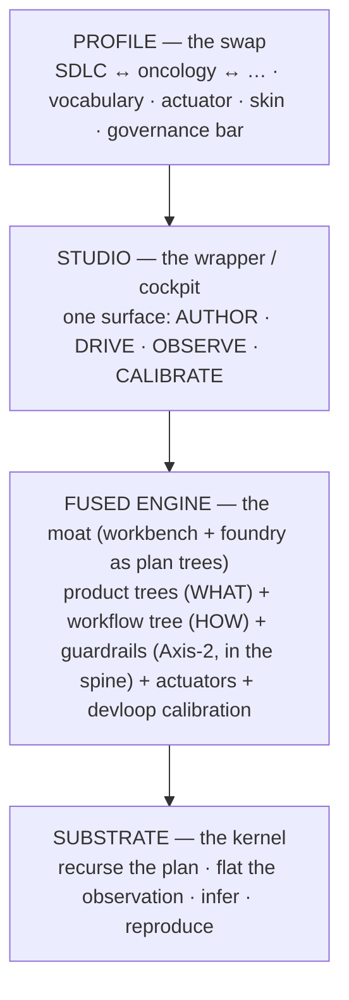

# The Unified Cockpit (north-star masterplan)

> The next big arc, after the System Builder Studio fusion (Phase A/B/C) lands. Goal: model the
> **entire workbench + foundry as plan trees**, so the dev/governance machinery is declared, observed,
> inferred, and reproduced like any other substrate system — and **Studio is the cockpit** that manages
> it. This is the "build the builder" thesis paying off: the factory becomes a first-class, calibratable
> system, which is what turns the foundry+workbench moat into the sellable SDLC-pro tool (and, swap the
> profile, the cancer-case-manager).

## North-star diagram (the four-layer frame)

Read top-down as "what the human touches → what runs it → what models it → what grounds it."
The reason **one** cockpit can manage **both** fused things (product trees = WHAT, workflow+governance
tree = HOW) is that in the kernel they are the **same shape** — single-parent intervention trees with
typed effects. They are isomorphic; the human never context-switches.

## The five layers (what exists vs. what this arc builds)

| Layer | State | This arc |
|---|---|---|
| 1. Product trees (WHAT) | ✅ foundry-native (build-paths) | consume |
| 2. Workflow tree (HOW) | ✅ first-class plan tree (ADR-263–267) | extend + surface in the cockpit |
| 3. Governance / guardrails | ❌ imperative agents + config today | **MODEL as Axis-2 conditional interventions in the spine** (the big piece) |
| 4. Arsenal (agents + skills) | ✅ exists | treat as **actuators** the nodes invoke (not tree nodes) |
| 5. Calibration (devloop twin) | ✅ exists | wire predicted-vs-observed onto the modeled guardrails/gates |

## Two orthogonal axes (the correction that unlocked this)

- **Axis 1 — Profile (domain):** SDLC, oncology, … — vocabulary + actuator + skin + governance bar.
- **Axis 2 — Intervention kind (in any tree):** forward-intervention · gate · **guardrail** (conditional/
  bounded intervention). Guardrails are **cross-cutting** — they live in the **spine**, composed into
  *every* profile's tree, parameterized by the domain's boundaries. You do not "swap to" guardrails;
  you compose them in. (Proof they're already real: the **disjointness gate** is a live triggered-when-
  exceeding-boundary SDLC guardrail; **charter-checker** is an always-running one — today imperative,
  not yet modeled.)

## Studio = the cockpit (not a viewer, not an IDE)

The wrapper is a **cockpit**: AUTHOR a plan, DRIVE it (advance/authorize via the actuator), OBSERVE it
(the operate surface), CALIBRATE it (predicted-vs-observed). Its first organs already exist from the
fusion: the build-path designer (*author*), A2-operate (*observe/drive*), the Phase-C spine (the shared
runtime). Two boundaries hold it together:
- **Face, not source of truth** — Studio projects the trees, captures edit-intents, actuates through the
  spine; the foundry log stays authoritative (two-trees discipline, draft-projection, one-way push).
- **Cockpit, not IDE** — it manages *systems and the process as plan trees*; it is not a code editor
  (the fusion charter's explicit non-goal). You still write code in your editor.

## Phased decomposition (face-first, prove on ONE, then generalize)

Each phase becomes its own `/build-path` **when reached**, authored from the prior phase's reality
(never all at once). The ocean boils incrementally.

- **D1 — Guardrail tracer.** Model ONE guardrail (the **disjointness gate** — cleanest, already live)
  as a declared Axis-2 conditional intervention in the spine: guardrail node + boundary predicate
  (derived view) + enforcement actuator + observed firings in the event log. The B3-analogue: prove the
  machinery on one guardrail before generalizing.
- **D2 — Cockpit drive + workflow surface.** Extend A2 (read-only) into a true cockpit: surface the
  existing workflow tree, DRIVE it (advance/authorize via the actuator), show guardrail firings.
- **D3 — Calibration pane.** Wire devloop predicted-vs-observed for the modeled guardrail(s) into a
  Studio pane — the guardrail becomes measurable (posterior on "does it actually prevent collisions?",
  counterfactual on "what breaks without charter-checker?").
- **D4 — Generalize the guardrails.** Model the rest on the same machinery: charter-checker, verifier
  wave, founder gates, quality obligations.
- **D5 — Unify the trees + the profile.** Bring product trees + workflow tree + guardrails into one
  coherent model under one Studio canvas; fold in the **deferred cross-product `StudioProfile`
  unification** (path-builder ↔ fusion canonical).
- **D6+ — The ocean.** All five layers, all products; the foundry+workbench fully self-hosted (the
  foundry builds the model of the foundry; the guardrails governing that build are nodes in the tree
  being built).

## Discipline (the traps that will try to kill it)

- **Kernel minimality (ADR-176).** Model the *plan and governance logic*; guardrail/workflow *semantics*
  are pack/spine + `metadata`, never new kernel types. The generic conditional/temporal intervention
  already covers guardrails.
- **Mechanics stay actuators.** Git, `gh`, agent execution, the real-time enforcement hot-path never
  become kernel state. The kernel models; the actuator enforces (ring discipline: no synchronous
  inference in request paths).
- **Single-parent + derive, don't store.** A guardrail applies to many nodes → a derived cross-link /
  relation, NEVER multi-parent. The workflow frontier and guardrail predicates are derived views.
- **Face-first, then generalize.** Prove on ONE guardrail / ONE product's full loop, then widen — the
  same sequencing that just worked for the fusion (and the scenario-lab running-start before it).

## Execution

Foundry-conducted, phase-by-phase, autonomously (T0 where it stays demo/internal; zero kernel change is
the default expectation). Founder gates only for genuinely T2/regulated/irreversible forks. Studio repo
work stays disjoint from the live path-builder (`studio/**`) items. The arc is "done" when the cockpit
manages the full unified tree (product + workflow + guardrails) for the SDLC profile end-to-end, and the
profile-swap demonstrably re-skins it for a second domain.
