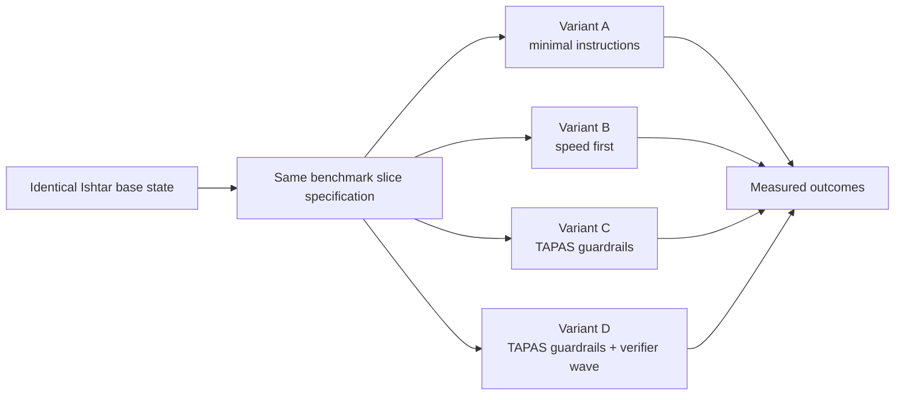

# Ishtar SDLC Variant Lab Concept

Date: 2026-06-25  
Status: concept for test-harness construction  
Audience: Claude or another implementation agent building the experiment  
Primary repo: `services/attp-tapas-ishtar`  
Workbench root: `D:/work/projects/attp-tapas-local-workbench`

## Purpose

The Ishtar SDLC Variant Lab is a controlled experiment for Swiss Post TAPAS.
It uses a real TAPAS service context, `attp-tapas-ishtar`, to compare how
different agent instructions, guardrails, and software delivery lifecycle
(SDLC) plan shapes affect delivery quality.

The experiment must not prove that an agent can blindly build TAPAS. It must
show something more useful for Post: the same realistic Ishtar slice produces
different outcomes when built under different SDLC controls.

The headline claim to test is:

> Stronger, context-aware AI-SDLC guardrails reduce rework and review findings
> on real TAPAS-style engineering tasks, without hiding the cost in cycle time.

## Why Ishtar Is a Good Test Object

Ishtar is a good benchmark because it is neither toy CRUD nor too broad to
reason about. It has real integration and correctness pressure:

- badge punch event ingestion from Kafka and gRPC;
- a two-layer state machine for activity and work-time state;
- PostgreSQL persistence with Flyway migrations and views;
- audit requirements for manual corrections;
- REST search for external consumers;
- Kafka broadcasts to downstream systems;
- Testcontainers-based integration tests;
- established TAPAS hexagonal architecture conventions.

Those traits create failure modes that are visible under weak agent guidance:

- missing edge cases in the state machine;
- incorrect work-day assignment around midnight;
- audit entries that miss acting-user context;
- migrations that pass locally but break repeatability;
- REST validation that is too permissive or too strict;
- tests that cover happy paths but miss domain invariants;
- architecture drift from ports-and-adapters boundaries.

## Non-Goals

This lab must not:

- rebuild the full Ishtar service;
- use production data or confidential operational examples;
- bypass TAPAS conventions to make the benchmark easier;
- rank individual developers or agents as people;
- treat speed alone as success;
- mutate `main` in any TAPAS repo while running experiments.

## Core Experiment Design

Each run starts from the same prepared repository state and the same product
slice specification. Only the SDLC variant changes.



The experiment should be repeated for at least two slices before making any
strong claim. One slice can be lucky; two different slices begin to show a
pattern.

## Recommended Benchmark Slices

Build the lab around small, isolated Ishtar-style changes. Each slice should
take an agent hours, not days, and should have deterministic acceptance tests.

### Slice 1: Punch Correction and Audit

This is the strongest first slice because it is business-relevant and easy to
explain to Post stakeholders.

Scenario:

1. A manual correction updates a punch.
2. The request must include an acting user.
3. The original punch is soft-deleted or superseded.
4. The corrected punch is created with a link to the original source punch.
5. A revision history query must show who changed what and when.

Expected failure modes:

- accepting corrections without acting-user identity;
- losing the before/after relationship;
- writing audit state outside the transaction;
- adding manual audit code where Envers should be used;
- testing only entity persistence, not audit retrieval.

Primary Ishtar references:

- `services/attp-tapas-ishtar/docs/project/025-feature-punch-audit.md`
- `services/attp-tapas-ishtar/docs/project/020-feature-timestamps.md`

### Slice 2: Overnight Work-Day Assignment

This slice tests domain reasoning around time boundaries.

Scenario:

1. An employee starts work before midnight.
2. The employee continues activity after midnight.
3. After-midnight punches still belong to the previous work day while the
   shift is active.
4. A new morning shift must not attach to the closed previous work day.

Expected failure modes:

- grouping by calendar day instead of shift start;
- creating duplicate work-day rows;
- using a fixed midnight boundary with no active-shift check;
- passing unit tests but failing repository integration tests.

Primary Ishtar references:

- `services/attp-tapas-ishtar/docs/project/020-feature-timestamps.md`
- `services/attp-tapas-ishtar/docs/project/040-database-schema.md`

### Slice 3: Activity Search Edge Cases

This slice tests API behavior and query correctness.

Scenario:

1. The search endpoint returns activities overlapping a requested time range.
2. It includes activities that start inside, end inside, or span the range.
3. It excludes soft-deleted activities.
4. It validates required parameters unless configuration explicitly relaxes
   them.

Expected failure modes:

- using only `start BETWEEN from AND to`;
- returning soft-deleted records;
- accepting missing required parameters;
- failing to map validation errors consistently.

Primary Ishtar references:

- `services/attp-tapas-ishtar/docs/project/030-feature-lisy.md`
- `services/attp-tapas-ishtar/docs/project/060-testing.md`

### Slice 4: Broadcast Safety

This slice tests integration discipline without requiring external Kafka in
the test.

Scenario:

1. A measured activity is persisted or updated.
2. A listener maps it into an activity-state event.
3. The full topic receives the complete event.
4. The anonymized topic receives a redacted version.
5. Integration tests must not require a live Kafka broker.

Expected failure modes:

- broadcasting from domain code instead of the configured adapter path;
- leaking personal identifiers into the anonymized event;
- making integration tests flaky by requiring real Kafka;
- duplicating mapping logic.

Primary Ishtar references:

- `services/attp-tapas-ishtar/docs/project/050-messaging.md`
- `services/attp-tapas-ishtar/docs/project/060-testing.md`

## SDLC Variants

Each variant must run against the same slice specification and base branch.
The result should be a branch or worktree plus a structured run log.

### Variant A: Minimal Instructions

Goal:

Measure the baseline behavior of an agent with only generic coding guidance.

Allowed context:

- the task statement;
- the target repository;
- existing code discovered by the agent.

Restrictions:

- do not provide TAPAS-specific architecture instructions up front;
- do not require designer-first work;
- do not require a verifier wave;
- still run the normal build and tests at the end.

Expected signal:

This variant often produces plausible code, but it may miss TAPAS conventions,
edge cases, or existing helper APIs.

### Variant B: Speed First

Goal:

Measure what happens when the agent is optimized for fast delivery.

Instruction stance:

- prefer the smallest change that appears to satisfy acceptance criteria;
- avoid broad refactoring;
- prioritize getting tests green quickly;
- add only the tests needed to prove the visible behavior.

Restrictions:

- no deliberate quality sabotage;
- no bypassing test or formatting gates;
- no direct modification of unrelated modules.

Expected signal:

This variant should be fast, but review findings and missing edge cases are
expected to rise.

### Variant C: TAPAS Guardrails

Goal:

Measure the effect of TAPAS-specific instructions and architecture conventions.

Required context:

- workbench `AGENTS.md`;
- `project-manifest.yml`;
- Ishtar `AGENTS.md`;
- relevant Ishtar project docs;
- shared TAPAS devops and architecture conventions when referenced.

Required behavior:

- keep ports-and-adapters boundaries intact;
- prefer existing test annotations and base classes;
- follow Maven, Flyway, naming, and error-handling conventions;
- cite domain docs when relying on domain rules.

Expected signal:

This variant should reduce architecture drift and improve test placement, but
may take longer than the speed-first variant.

### Variant D: TAPAS Guardrails plus Verifier Wave

Goal:

Measure the added value of adversarial review after a guarded implementation.

Required behavior:

- run Variant C implementation rules;
- after implementation, run independent review passes;
- require findings to be either fixed or explicitly accepted as non-blocking;
- record each finding with severity, file, line, and resolution.

Suggested verifier roles:

- Java reviewer: correctness, test gaps, maintainability;
- TAPAS architecture reviewer: module boundaries and conventions;
- QA reviewer: acceptance criteria, edge cases, regression risk;
- security/data reviewer: acting-user, audit, personal data, redaction.

Expected signal:

This variant may be slower but should have the best post-review quality and the
lowest unresolved critical findings.

## Measurement Model

The lab must pair speed with quality. A run is not successful merely because it
finishes quickly.

### Required Per-Run Metrics

Record these for every variant run:

| Metric | Meaning | Source |
| --- | --- | --- |
| Cycle time | Start to implementation complete | run log |
| Build status | Maven build result | command output |
| Unit test status | Unit tests passed or failed | Maven output |
| Integration test status | Integration tests passed or failed | Maven output |
| Changed files | Files touched by the agent | git diff |
| Diff size | Added plus deleted lines | git diff |
| Review findings | Count by severity | verifier outputs |
| Findings fixed | Findings resolved before final result | verifier outputs |
| Acceptance pass rate | Slice acceptance tests passed | test harness |
| Rework commits | Commits after first review | git history |
| Architecture drift | Boundary or convention violations | review |

### Recommended Quality Verdict

Use a paired verdict rather than a single score:

- speed improved or degraded;
- quality improved or degraded;
- rework increased or decreased;
- unresolved high-severity findings present or absent.

The lab may render a summary table, but it must keep the underlying evidence.

Example verdict labels:

- `fast-but-risky`;
- `slow-and-clean`;
- `balanced`;
- `failed-gates`;
- `inconclusive`.

## Test-Harness Requirements

Claude should build a harness that prepares, runs, and evaluates each variant.
The first version can be script-driven; it does not need a UI.

### Repository Safety

The harness must:

- create one isolated worktree or clone per variant;
- never run experiments on `main` directly;
- preserve the base SHA used for every run;
- write all run logs under a dedicated output directory;
- never use production credentials;
- never connect to production Kafka, RDS, or Confluent Cloud.

### Suggested Directory Layout

```text
qa/ishtar-sdlc-variant-lab/
  README.md
  scenarios/
    slice-1-punch-correction-audit.md
    slice-2-overnight-workday.md
    slice-3-activity-search-edge-cases.md
    slice-4-broadcast-safety.md
  variants/
    A-minimal-instructions.md
    B-speed-first.md
    C-tapas-guardrails.md
    D-tapas-guardrails-verifier-wave.md
  scripts/
    prepare-run.ps1
    collect-metrics.ps1
    run-gates.ps1
  results/
    .gitkeep
```

If this directory is placed inside another repo, choose the repo that already
owns QA or evaluation assets. Do not add it inside `attp-tapas-ishtar` unless
the experiment intentionally becomes part of that service's test suite.

### Scenario Specification Format

Each scenario file should contain:

- title and intent;
- target modules;
- business rule summary;
- acceptance criteria;
- required tests;
- forbidden shortcuts;
- known failure modes;
- references to Ishtar docs and code;
- expected command gates.

### Variant Specification Format

Each variant file should contain:

- objective;
- allowed context;
- required context;
- process instructions;
- review instructions;
- output format;
- what must be measured.

## Acceptance Tests for the Lab Itself

The lab is only useful if the harness is deterministic enough to compare runs.
Claude should create tests or smoke checks for the harness:

1. Preparing two variant runs from the same base SHA yields two different
   isolated working directories.
2. The base SHA is recorded in every run manifest.
3. The metrics collector reports changed files and diff size correctly.
4. The gate runner captures Maven success and failure without hiding output.
5. A verifier finding file with known data produces the expected summary.
6. The report generator keeps speed and quality metrics separate.

## Recommended First Build Plan for Claude

Claude should implement the lab in small steps.

### Step 1: Freeze the Experiment Contract

Create the `qa/ishtar-sdlc-variant-lab` folder with scenario and variant files.
Start with Slice 1 only.

Deliverables:

- `README.md`;
- one Slice 1 scenario file;
- four variant instruction files;
- one run-manifest schema, documented in Markdown.

### Step 2: Add the Run Harness

Add scripts that prepare isolated worktrees and write a run manifest.

Deliverables:

- `prepare-run.ps1`;
- example manifest for a dry run;
- smoke test or documented manual check.

### Step 3: Add Gate Execution

Add a script that runs the Ishtar build gates using the configured TAPAS Maven
setup.

Deliverables:

- `run-gates.ps1`;
- captured gate log path;
- parsed gate summary in JSON.

### Step 4: Add Metrics Collection

Add a script that collects git diff metrics and merges them with gate results.

Deliverables:

- `collect-metrics.ps1`;
- `metrics.json`;
- Markdown run summary.

### Step 5: Add Review Findings Import

Add a simple JSON input format for verifier findings. The first version can be
manually populated by reviewers.

Deliverables:

- `findings.schema.json` or documented JSON shape;
- findings summary in the run report;
- resolved versus unresolved counts.

### Step 6: Run One Pilot Variant

Run only Variant C against Slice 1 first. The goal is to validate the harness,
not yet to compare all variants.

Deliverables:

- one complete run directory;
- one report;
- list of harness defects found during the pilot.

## Claude Prompt Template

Use this prompt when asking Claude to build the first version.

```text
You are working in D:/work/projects/attp-tapas-local-workbench.

Build the first version of the Ishtar SDLC Variant Lab described in:
docs/superpowers/specs/2026-06-25-ishtar-sdlc-variant-lab-concept.md

Scope for this session:
1. Create the lab folder under qa/ishtar-sdlc-variant-lab.
2. Write the Slice 1 scenario file for Punch Correction and Audit.
3. Write the four variant instruction files.
4. Add a README explaining how to run the lab manually.
5. Add a run-manifest JSON example and document its fields.

Do not implement the actual Ishtar slice yet.
Do not modify services/attp-tapas-ishtar source code.
Do not connect to production systems.
Keep the output suitable for Swiss Post stakeholders and TAPAS engineers.
```

## Open Questions

These decisions should be made before running the full comparison:

1. Which branch or commit of `attp-tapas-ishtar` is the frozen base?
2. Should the first pilot use real worktrees or disposable local clones?
3. Which Maven command is the official local gate for the lab?
4. Should verifier findings be generated by Claude subagents, human reviewers,
   or both?
5. Will the comparison report stay internal to Post, or may it be shown as a
   sanitized external case study later?

## Success Criteria

The concept is ready for implementation when:

- a Claude session can create the lab structure without asking for domain
  clarification;
- the first scenario is specific enough to produce deterministic acceptance
  tests;
- each variant differs only in process and instructions, not in task scope;
- the metric model prevents a speed-only success claim;
- the harness can run without production dependencies.
