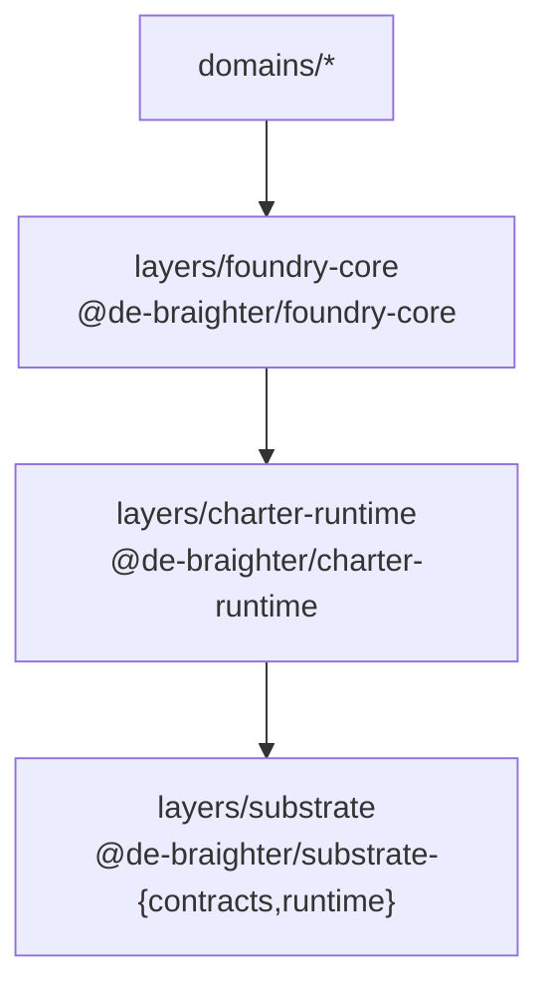

# Foundry SDK — Three-Pillar Unification

> **The move.** Charters, foundries, and plan trees are three semantic lenses on ONE
> `PlanNode` primitive. A Foundry SDK lets AI operate purely as a metamodeler —
> describe what should exist — and the foundry materializes artifacts at any level:
> charter nodes, kernel plan subtrees, TypeScript code, or knowledge nodes. Every
> manifest definition is itself a plan node. Every artifact is a plan node. Every run
> record is a plan node. Plan trees all the way down; the kernel stays blind.

---

## 0. Context

The cluster already has three production primitives:

- **Kernel `PlanNode`** — recursive single-parent tree, `metadata: z.record(z.unknown())`.
  The kernel stores it and never interprets `metadata` (ADR-127, ADR-153).
- **`CharterNode`** — `PlanNode + metadata.charter` (Zod-validated governance contract).
  Lives in `layers/charter-runtime`; ADR-283 ratified. This is the first demonstrated
  proof that a layer-owned shape on `metadata` is sufficient for rich semantics.
- **Code generation** — `gen_*` MCP tools, ADR-274/275. AI describes a feature;
  deterministic codegen materializes TypeScript/Angular artifacts. Already live.

The observation that unifies them: **every foundry run, every blueprint, every generated
file, every charter node is already expressible as `PlanNode + metadata.*`.** The three
pillars have been running independently; this design defines the shared protocol that
makes them one.

---

## 1. Core Insight — Three Lenses, One Primitive

| Lens | What it produces | `metadata` key |
|---|---|---|
| Charter | `CharterNode` plan tree (governance contract) | `metadata.charter` |
| Plan tree | Kernel `PlanNode` subtree (work decomposition) | `metadata.foundry.artifact` |
| Code | TypeScript/Angular files via `gen_*` | `metadata.foundry.artifact` |
| Knowledge | Knowledge nodes (documents, blueprints) | `metadata.knowledge` |
| Meta | A new `FoundryManifest` plan node | `metadata.foundry.manifest` |

The three metadata keys the Foundry SDK stamps on `PlanNode`:

```text
metadata.foundry.manifest  → this node IS a foundry skin definition (the protocol itself)
metadata.foundry.run       → this node IS a foundry execution record
metadata.foundry.artifact  → this node IS an artifact produced by a run
```

The kernel stores all three opaquely. The layer validates and interprets them.

---

## 2. Architecture (Approach C — Meta-Manifest)

The chosen approach is not "per-level SDKs with a shared protocol" — it is that
**manifests themselves are plan nodes.** Every manifest definition is stored as
`PlanNode + metadata.foundry.manifest`. This makes manifests discoverable, versionable,
and generatable by the meta-foundry.

### 2.1 Shared Protocol

The `layers/foundry-core` layer (package `@de-braighter/foundry-core`) publishes:

```ts
interface FoundryManifest<TSpec, TArtifact> {
  kind: string;             // 'charter' | 'plan-tree' | 'code' | 'knowledge' | 'meta'
  specSchema: ZodSchema<TSpec>;        // validates the AI's metamodel description
  generate(spec: TSpec, ctx: FoundryContext): Promise<TArtifact>;
  persist(artifact: TArtifact, ctx: FoundryContext): Promise<PlanNode>;
}

class CoreFoundry {
  execute<TSpec, TArtifact>(
    manifest: FoundryManifest<TSpec, TArtifact>,
    spec: TSpec
  ): Promise<PlanNode>;
  // 1. Looks up manifest by kind from the plan tree
  // 2. Validates spec against manifest.specSchema
  // 3. Runs manifest.generate(spec, ctx)
  // 4. Calls manifest.persist(artifact, ctx) → stores artifact + run record as PlanNodes
  // 5. Returns the artifact PlanNode
}
```

`FoundryContext` carries the substrate session (tenant, run manifest reference,
parent plan node). Every call to `execute()` produces exactly three plan nodes:
the manifest reference (looked up, not created), the run record
(`metadata.foundry.run`), and the artifact (`metadata.foundry.artifact`).

### 2.2 The Meta-Manifest

A special manifest with `kind='meta'`. Its spec is a natural-language or structured
description of a new artifact kind. Its artifact is a new `FoundryManifest` persisted
as a plan node. Once Phase 2 ships, all subsequent manifest definitions can be generated
by the meta-foundry itself. Bootstrapped by one hand-written seed manifest — then
self-replicating.

The fractal closure: every foundry run is a plan tree; every artifact is a plan node;
every manifest is a plan node. The AI metamodels at any level; the foundry materializes.

---

## 3. Layer Placement

### 3.1 Ring dependency



`layers/foundry-core` is a new cluster layer, peer to `layers/charter-runtime`. It is
NOT in `domains/foundry` — domain packs cannot be consumed cross-domain (ADR-027), and
the foundry SDK must be consumable by exercir, studio, conservation, and future domains.
The same constraint drove `charter-runtime` to a layer; `foundry-core` follows the
same precedent (ADR-283).

### 3.2 ADR-176 Inclusion Test

The kernel minimality test requires **both** conditions to enter the kernel:

- **(a) Is it one of the four kernel concerns?** No. Foundry manifests are not plan
  recursion, observation, inference, or reproducibility. They are a capability composed
  *from* those concerns. Fails (a).
- **(b) Must the kernel validate/query/version it for ≥2 packs?** No. The layer
  validates; the kernel stores opaque `metadata`. Fails (b).

**Verdict: layer territory, decisively.** The kernel stores `PlanNode` rows with
`metadata.foundry.*`; it never reads or interprets those keys.

---

## 4. Per-Level Skins

Each skin implements `FoundryManifest` and is published as part of `layers/foundry-core`
or its consuming layer.

### 4.1 Charter Skin (`kind='charter'`)

- **Spec:** A description of a charter — name, scope, governance rules, effect
  declarations, lifecycle states.
- **Generate:** Produces a `CharterNode` tree (delegates to `layers/charter-runtime`,
  ADR-283).
- **Persist:** Stores the root `CharterNode` as a plan node with
  `metadata.charter` + `metadata.foundry.artifact`.
- **Validation:** `specSchema` enforces the charter-runtime contract shape.

### 4.2 Plan-Tree Skin (`kind='plan-tree'`)

- **Spec:** A description of a work decomposition — goal, phases, tasks, effect
  declarations per node.
- **Generate:** Produces a subtree of `PlanNode` records with typed effect declarations
  (ADR-154).
- **Persist:** Inserts the subtree under a parent plan node; root node stamped with
  `metadata.foundry.artifact`.

### 4.3 Code Skin (`kind='code'`)

- **Spec:** A feature description — kind, target library, operations, API shape.
- **Generate:** Delegates to the existing `gen_*` MCP tools (ADR-274, ADR-275). The
  spec maps directly onto the `gen_generate` operation catalog entry.
- **Persist:** Stores file references and a content hash as `metadata.foundry.artifact`
  on the plan node representing the generated feature.
- **No duplication:** This skin is a thin wrapper; it does not re-implement codegen.

### 4.4 Knowledge Skin (`kind='knowledge'`)

- **Spec:** A knowledge node description — kind, summary, content reference, initial
  citations.
- **Generate:** Produces a `knowledge` layer node (per the knowledge-pack design,
  `metadata.knowledge`).
- **Persist:** Stores the knowledge node via `layers/knowledge` ports; stamped with
  `metadata.foundry.artifact`.
- **Dependency:** Requires `layers/knowledge` (Phase 3; deferred until knowledge layer
  ships).

### 4.5 Meta Skin (`kind='meta'`)

- **Spec:** A description of a new artifact kind — name, spec shape description,
  generate/persist strategy.
- **Generate:** Produces a `FoundryManifest` object (in-memory TypeScript).
- **Persist:** Serializes the manifest as a plan node with `metadata.foundry.manifest`.
  After this, `CoreFoundry.execute()` can look it up by kind from the plan tree and
  execute it.
- **Bootstrap:** The meta-skin itself is the one hand-written seed manifest. All
  subsequent manifest kinds can be produced by the meta-foundry.

---

## 5. Phased Implementation

### Phase 1 — `layers/foundry-core` foundation + charter skin

**Goal:** Validate the `FoundryManifest` protocol end-to-end with the most concrete
skin. The charter skin is the best choice: it exercises the full round-trip
(spec → generate → persist → plan node) against a layer that already exists
(`charter-runtime`, ADR-283 S1 merged).

Deliverables:

- `layers/foundry-core` library scaffold (`@de-braighter/foundry-core`).
- `FoundryManifest<TSpec, TArtifact>` interface + `FoundryContext` type.
- `CoreFoundry` class with `execute()`.
- Charter skin (`kind='charter'`): spec schema, generate, persist.
- Seed plan nodes for the charter-skin manifest itself (`metadata.foundry.manifest`).
- Integration test: `execute(charterManifest, charterSpec)` → verify three plan nodes
  created (run + artifact + manifest reference).

Gate: charter skin round-trip passes; no kernel change; ADR-176 test documented in PR.

### Phase 2 — Meta-foundry skin

**Goal:** Make the manifest registry self-referential — new manifest kinds can be
produced by `CoreFoundry` itself.

Deliverables:

- Meta skin (`kind='meta'`): spec schema (freeform + structured), generate (produces
  `FoundryManifest` object), persist (serializes as plan node).
- `CoreFoundry.execute()` extended to look up manifests by kind from the plan tree
  (rather than a hard-coded registry).
- Plan-tree skin (`kind='plan-tree'`): first manifest generated via the meta-foundry
  (proves the loop closes).
- Seed migration: hand-write the meta-skin manifest plan node; use it to generate the
  plan-tree skin manifest.

Gate: meta-foundry generates the plan-tree skin; round-trip verifiable from plan tree
alone (no source code registry required).

### Phase 3 — Remaining skins + `domains/foundry` migration

**Goal:** Complete the skin set; migrate `domains/foundry` onto `charter-runtime`
(ADR-283 S3).

Deliverables:

- Code skin (`kind='code'`): thin wrapper over `gen_*` MCP tools.
- Knowledge skin (`kind='knowledge'`): depends on `layers/knowledge` shipping (tracked
  separately).
- `domains/foundry` migrated: existing foundry workers dispatch via `CoreFoundry`;
  blueprint/run records stored as `metadata.foundry.*` plan nodes.
- Backward-compatible: existing `foundry_*` MCP surface unchanged during migration
  (strangler-fig pattern).

Gate: `domains/foundry` green on main with zero kernel change; all four skins
exercised in integration tests.

---

## 6. Bootstrapping

Initial manifests are hand-written plan nodes, seeded in a single migration that runs
once on `foundry-core` first deploy. The seed set:

1. The **meta-skin manifest** (`metadata.foundry.manifest`, `kind='meta'`).
2. The **charter-skin manifest** (`kind='charter'`).

After Phase 2 ships, any new manifest is generated by the meta-foundry and persisted
into the plan tree — the cluster's own plan tree becomes the manifest registry.

---

## 7. Consequences

### Positive

- **One primitive, five semantic lenses.** No new kernel concept required. The kernel's
  opaque `metadata` design proves its strength at a new scale.
- **Manifests are discoverable.** Because manifests are plan nodes, they are queryable,
  versionable, and auditable via the same substrate machinery as all other plan nodes.
- **AI operates at the right altitude.** The AI describes what should exist (the spec);
  the foundry handles how (the manifest protocol). No AI-generated code paths bypass
  the typed schema validation layer.
- **Phased risk.** Phase 1 ships value (charter skin) before the self-referential
  complexity (Phase 2) is needed. Phase 3 is independently deferrable.
- **Codegen integration is zero-cost.** The code skin is a thin wrapper; ADR-274/275
  work is reused, not re-implemented.

### Constraints and watch-points

- **Knowledge skin depends on `layers/knowledge`.** Phase 3 knowledge skin is blocked
  until the knowledge layer ships (tracked separately). The other three skins are
  independent.
- **Meta-skin bootstrap is hand-written.** One manifest (the meta-skin itself) cannot
  be self-generated. This is an acceptable bootstrap invariant — the meta-skin is small
  and stable.
- **`domains/foundry` migration (Phase 3) is a strangler-fig.** Existing MCP surface
  must remain unchanged during migration to avoid breaking running foundry workers.
  Gate: integration tests cover both the old and new dispatch paths before the old path
  is removed.
- **`metadata.foundry.*` key reservation.** Once Phase 1 ships, these three keys
  (`manifest`, `run`, `artifact`) must be treated as reserved by the foundry layer
  across all plan nodes in the cluster. A brief conventions note in the cluster
  CLAUDE.md or a layer-level schema validation guards against collision.
