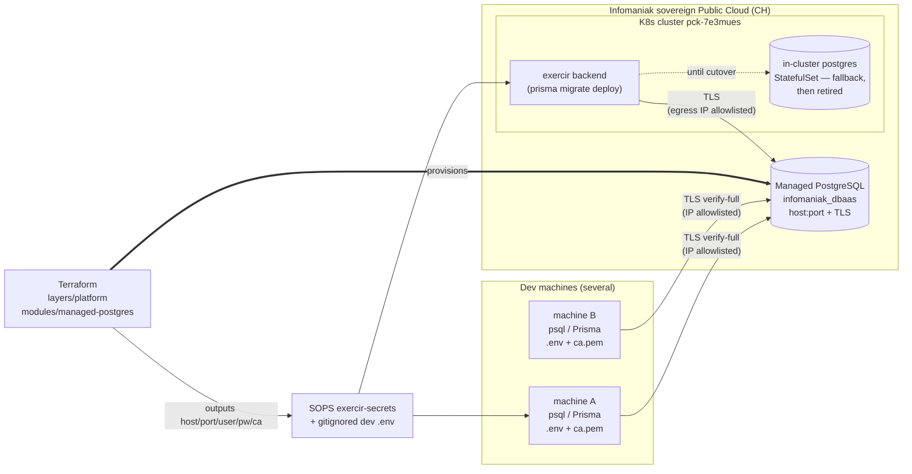

# Infomaniak Managed PostgreSQL — shared dev/staging DB

> **Why now.** The "Infomaniak Postgres" today is an in-cluster `postgres`
> StatefulSet (`pgvector/pgvector:pg16`, namespace `exercir`, ClusterIP
> `postgres:5432`) reachable only via kubeconfig + `kubectl port-forward`. The
> platform concept doc calls it *"Postgres-in-cluster — Phase 1 only"* and notes
> Infomaniak managed DBs were *MySQL only*. That last point went **stale in
> January 2026**, when Infomaniak launched managed PostgreSQL in its sovereign
> Public Cloud (with a Terraform provider, `Infomaniak/infomaniak` v1.4.1,
> resource `infomaniak_dbaas`). This spec is the Phase-2 upgrade the docs always
> intended.

## 1. Goal, scope, non-goals

**Goal.** A single Infomaniak Managed PostgreSQL instance, provisioned by
Terraform in `layers/platform`, serving as a **shared dev/staging database**:
reachable directly from several developer machines over a public TLS endpoint
(IP-allowlisted), and from the deployed `exercir` k8s backend — replacing the
in-cluster StatefulSet.

**In scope.**

- Terraform module `layers/platform/terraform/modules/managed-postgres/` wrapping
  the `infomaniak_dbaas` resource (smallest single-instance pack, no SLA).
- Per-domain database + dual-role (migrate/admin + non-superuser `app`) creation
  by **reusing** the repo's `tools/db/setup.mjs` against the new instance — no
  fork of RLS/role logic.
- **Initial scope: the `exercir` database only** (what the in-cluster DB serves
  today), plus `knowledge` *iff* the pgvector gate passes.
- Secret wiring: Terraform outputs (host/port/user/password/ca) land in the
  SOPS/age `exercir-secrets` (backend cutover) **and** a gitignored dev `.env`.
- An onboarding recipe for a second machine (copy `.env` + CA cert — no
  kubeconfig/age key needed for DB access anymore).
- A pgvector verification gate with a defined fallback.

**Out of scope (follow-on).**

- The actual `pg_dump`/restore **data migration** + backend cutover + StatefulSet
  retirement (sequenced after provisioning + dev access is proven).
- Provisioning databases for **other domains** (markets, health, agri, whales,
  substrate, devloop) — added on demand later.
- HA (multi-node clusters), production hardening, SLA tiers.

**Non-goals.** No real PHI/production data on this instance (it is dev/staging).
No change to the substrate kernel — this is pure Ring-5/platform infrastructure.

## 2. Decisions

| # | Decision | Choice |
|---|----------|--------|
| D1 | Hosting | Infomaniak Managed PostgreSQL DBaaS, **single instance, smallest pack, no SLA** (dev-grade). |
| D2 | Provisioning | **Terraform** (`infomaniak_dbaas`) in `layers/platform/terraform`, composed from the existing root (Infomaniak provider + S3 state backend). |
| D3 | DB + roles | **Reuse `tools/db/setup.mjs`** against the new `DATABASE_URL_MIGRATE`; Terraform owns only the instance, not per-DB/role layout. |
| D4 | Initial DB scope | **`exercir` only** (+ `knowledge` iff pgvector passes). Other domains added on demand. |
| D5 | pgvector fallback | If managed Postgres can't `CREATE EXTENSION vector` → **dedicated pgvector instance** for the knowledge/vector workload; relational domains still move to managed. Non-blocking. |
| D6 | Network access | Public `host:port` gated by **`allowed_cidrs`** (each dev machine's public IP + the cluster egress IP). Empty list blocks everyone — never empty. |
| D7 | TLS | Use the resource's `ca` output; dev connects `sslmode=verify-full` with the CA file (`PGSSLROOTCERT`). |
| D8 | Secrets | Admin creds + CA → SOPS/age `exercir-secrets` (backend) **and** a gitignored dev `.env`. Never committed in plaintext. |
| D9 | Cutover | In-cluster StatefulSet stays as fallback until the managed instance is verified; retired only post-cutover (follow-on). |
| D10 | Data migration | Deferred to a follow-on phase; provisioning + dev-machine access ships first. |

## 3. Architecture

**Two consumer classes, one endpoint.** Dev machines and the deployed backend
hit the same public `host:port` over TLS; the only difference is which IPs are in
`allowed_cidrs` (dev public IPs + the cluster's egress IP).

## 4. Terraform module

`layers/platform/terraform/modules/managed-postgres/`:

- **`main.tf`** — one `infomaniak_dbaas` resource. Required args wired to vars:
  `public_cloud_id`, `public_cloud_project_id`, `name`, `pack_name` (smallest
  pack — confirm exact name, e.g. `pro-*`, at `plan` time), `type` (`postgresql`
  — confirm exact enum), `version` (PG 16.x to match the in-cluster image),
  `region` (e.g. `dc4-a`), `allowed_cidrs` (var list), `configuration`
  (engine params: `max_connections`, etc.).
- **`variables.tf`** — `allowed_cidrs` (list), `pack_name`, `version`, `region`,
  project ids.
- **`outputs.tf`** — `host`, `port`, `user`, **`password` (sensitive)**, `ca`,
  `id`. Marked sensitive; consumed by the secrets step, never echoed.
- Composed from the existing root module/stack (same provider config + S3
  `tfstate` backend already used for the k8s-cluster + s3-bucket modules).

> **Exact `type`/`version`/`pack_name` enums** are confirmed at implementation
> via `tofu plan` against the project / the Infomaniak manager — the example in
> the provider docs is MySQL (`type = "mysql"`, `pack_name = "pro-4"`).

## 5. Databases & roles (reuse, don't fork)

`infomaniak_dbaas` yields **one admin role** + host/port/ca — it does not model
per-database or per-role layout. So:

1. Build `DATABASE_URL_MIGRATE` from the Terraform admin output (+ `sslmode` +
   CA path).
2. Run the repo's existing **`tools/db/setup.mjs`** (and `seed.mjs`) against it —
   the same scripts used locally. They create the database, the non-superuser
   `app` role, and apply Prisma migrations + RLS, so the substrate posture
   (ADR-027: `app.tenant_pack_id` GUC, row-scoped RLS) is identical to local dev.
3. Result: `app` role → `SUBSTRATE_APP_DATABASE_URL`; admin role →
   `DATABASE_URL_MIGRATE`. Mirrors the dual-URL pattern already in every domain
   `.env`.

## 6. Networking, TLS, secrets

- **Access control** is `allowed_cidrs`: each dev machine's **public** IP (`/32`)
  plus the **cluster egress IP** (for the backend). Home-ISP dynamic IPs are an
  operational wrinkle — update the list when an IP changes (or use a wider CIDR,
  accepting the dev-grade trade-off). **Never set the list empty — that locks
  everyone out, including you.**
- **TLS**: the `ca` output is written to a CA file; dev connects
  `sslmode=verify-full` with `PGSSLROOTCERT=<ca.pem>`. (`require` is an
  acceptable fallback if verify-full is fiddly on a given machine.)
- **Secrets handling** (per `secrets-management.md`, ADR-020 SOPS/age):
  - Backend: update `DATABASE_URL` (and `POSTGRES_*`) inside the SOPS-encrypted
    `exercir-secrets` overlay → `sops -d` only at apply.
  - Dev: a **gitignored** `.env` carrying `DATABASE_URL`, `DATABASE_URL_MIGRATE`,
    `SUBSTRATE_APP_DATABASE_URL`, `PGSSLROOTCERT`. Plaintext creds never committed.

## 7. pgvector gate (Step 0 of execution)

Provision the instance, then `psql … -c "CREATE EXTENSION IF NOT EXISTS vector;"`.

- **Pass** → the `knowledge` database joins the managed instance; full Phase-2.
- **Fail** (extension not allowlisted by Infomaniak) → **D5 fallback**: relational
  domains (`exercir` first) move to the managed instance; the **knowledge/pgvector
  workload moves to a dedicated pgvector instance** — a small Postgres carrying
  `pgvector`, separate from the relational instance (self-hosted or a second
  managed instance if/when Infomaniak adds the extension). The migration is **not
  blocked**, and the relational and vector stores are cleanly separated.

This gate runs before any data migration so the topology is known up front.

## 8. Onboarding another machine (the original question, Phase-2 answer)

Once the managed instance exists, a second machine needs **only**:

1. The gitignored dev **`.env`** (DB URLs + `PGSSLROOTCERT`).
2. The **CA certificate** file referenced by `PGSSLROOTCERT`.
3. Its **public IP added to `allowed_cidrs`** (one-line tfvars edit + `apply`).
4. Client tooling: `psql` / the domain's Prisma toolchain.

No kubeconfig, no age key, no `port-forward` — a strict security improvement over
the in-cluster model (which required carrying cluster-admin + decrypt-everything
credentials).

> **Interim (today, before this ships):** to reach the *existing in-cluster* DB
> from another machine you still need the kubeconfig (`~/.kube/config`, context
> `kubernetes-admin@pck-7e3mues`) + the age key (`~/.config/sops/age/keys.txt`) +
> `kubectl -n exercir port-forward svc/postgres 5432:5432`. Transfer those two
> files only over a secure channel — they are full cluster-admin + decrypt keys.

## 9. Verification

- `tofu plan`/`apply` succeeds; `infomaniak_dbaas` reports `host`/`port`/`ca`.
- From an allowlisted dev machine: `psql "$DATABASE_URL"` connects over TLS
  (`\conninfo` shows SSL); `tools/db/setup.mjs` completes; Prisma `migrate
  deploy` is clean; the `app` role is non-superuser and RLS is enforced
  (a cross-tenant read is denied).
- pgvector gate result recorded (pass/fail → topology).
- A second machine, given only `.env` + CA + an allowlist entry, connects with no
  kubeconfig/age key.

## 10. Risks & open questions

- **pgvector availability** — unconfirmed from public docs; gated (§7). Primary
  risk; fallback defined.
- **Exact provider enums** (`type`/`version`/`pack_name`) — confirm at `plan`.
- **Dynamic dev IPs** vs `allowed_cidrs` — operational friction; accepted at
  dev grade.
- **Cost** — a managed flavor has a monthly fee (smallest pack); accepted vs the
  ops cost of self-hosting.
- **Provider maturity** — `infomaniak_dbaas` is new (provider v1.x); if a needed
  knob is missing, fall back to the Infomaniak API / manager for that field and
  import. (This is why "both Terraform + console fallback" remains available even
  though Terraform is the source of truth.)
- **Data migration** — deferred; in-cluster DB remains authoritative until the
  follow-on cutover verifies the managed instance.
